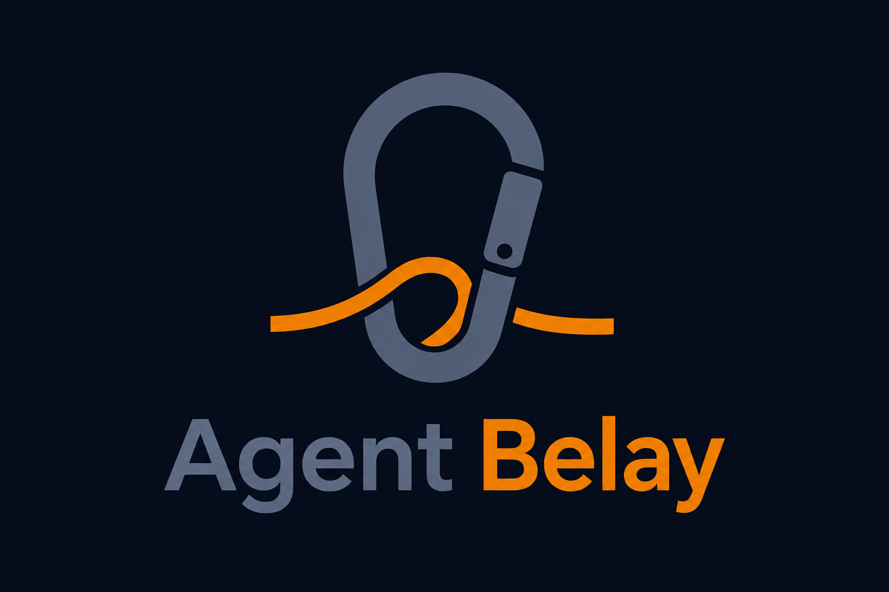

# Belay

[](https://www.npmjs.com/package/@guilz-dev/belay)
[](https://skills.sh/guilz-dev/belay)
[](https://github.com/guilz-dev/belay/actions/workflows/ci.yml)
[](https://opensource.org/licenses/MIT)

**A safety gate for coding agents that stops only the actions you can't undo.**

[Documentation (日本語)](./docs/README.ja.md)

`@guilz-dev/belay` hooks into agent runtimes (Cursor, Claude Code, Codex) and
inspects each shell command, subagent launch, and file mutation *before* it runs.
Most actions pass through untouched. Only the irreversible-and-catastrophic ones
are held back for one-shot human approval — and every decision is written to an
audit log.

<p align="center">
  
</p>

> **0.0.x early release** — APIs and behavior may change. Cursor and Claude Code
> are the supported adapters; Codex is experimental.

## Supported agents

Belay works across three coding agents. Each one runs the **same classifier**,
wired in through that agent's native **hook** mechanism — no agent-specific
policy to maintain.

| Agent | Status | Hook config | belay config |
|-------|--------|-------------|--------------|
| **Cursor** | Supported | `.cursor/hooks.json` | `.cursor/belay.config.json` |
| **Claude Code** | Supported | `.claude/settings.json` | `.claude/belay.config.json` |
| **Codex** | Experimental | `.codex/config.toml` | `.codex/belay.config.json` |

Pick the adapter at install time with `--adapter cursor|claude|codex` (or use
`belay config` interactively). Hosts use different hook event names, but Belay registers
the same runners (`belay-tool-gate`, `belay-before-submit`, `belay-audit`) at
equivalent lifecycle points:

| Role | belay hook | Cursor | Claude Code | Codex |
|------|-----------|--------|-------------|-------|
| Gate shell / tools / file mutations | `belay-tool-gate` | `beforeShellExecution`, `preToolUse` | `PreToolUse` | `PreToolUse` |
| Gate subagent launches | `belay-tool-gate` | `subagentStart` | (via `PreToolUse`) | `SubagentStart` |
| One-shot approvals | `belay-before-submit` | `beforeSubmitPrompt` | `UserPromptSubmit` | `UserPromptSubmit` |
| Audit log | `belay-audit` | `postToolUse`, `postToolUseFailure`, `stop`, `sessionEnd` | `PostToolUse` | `PostToolUse` |

## Why

Static denylists don't work for agents. The same command (`rm`, `curl`, a
deploy script) can be harmless in one context and catastrophic in another, and a
hand-maintained "never run this" list is always out of date and easy to work
around.

Belay moves the decision away from command names. For every gated action it
forms its own judgment based on:

- **reversibility** — can this be undone?
- **external effects** — does it reach outside the machine?
- **blast radius** — how much could it affect?
- **confidence** — how sure are we?

When the action looks safe and local, it runs. When it looks irreversible,
externally destructive, or ambiguous, Belay falls back to explicit approval and
audit instead of guessing.

## Quick start

```bash
# Interactive setup (adapter, scope, skill, judge provider, credentials)
belay config

# Or non-interactive
npx @guilz-dev/belay init --adapter claude   # Claude Code
npx @guilz-dev/belay init --adapter codex    # Codex (experimental)
npx @guilz-dev/belay init                     # Cursor (default)
```

After install, verify the floor is healthy:

```bash
npx @guilz-dev/belay doctor
npx @guilz-dev/belay status
```

Fresh installs default to **fail-closed** shell policy: unknown or unparseable
shell commands are denied until approved. Use `belay explain` to inspect a
verdict. Correct inaccurate EffectPlan semantics or resource scope; otherwise
approve the exact request for one-shot, resource-scoped authorization.

## How it works

Belay registers hooks on the host runtime (`.cursor/hooks.json`,
`.claude/settings.json`, or `.codex/config.toml`) and gates shell execution,
subagent launches, and file mutations through one shared classifier. It always
forms its own judgment — it does not trust an assessment supplied by the agent.

Every gated action gets one of three verdicts:

| Verdict | Meaning |
|---------|---------|
| `allow` | Safe and read-only — runs without intervention |
| `allow_flagged` | Local mutation or unknown-but-local effect — runs, but recorded for audit |
| `deny_pending_approval` | Irreversible, externally destructive, or ambiguous — blocked, issues an approval ID |

When an action is denied, approve the **next matching action once** by sending:

```text
/belay-approve <approval-id>
```

With the default `approval.flow: one_step`, an editor approval immediately replays the exact denied
shell action; no follow-up prompt is required. Tool and subagent approvals still require retrying
the original action unchanged. The one-shot grant is claimed before shell replay, so a failed or
timed-out replay requires a fresh approval. Replay runs through the configured `BoundaryDriver`.
After replay succeeds, the approval prompt continues the current host turn so the agent can report
the result and resume its workflow without another user message.
You may put a follow-up instruction on the lines after `/belay-approve <id>`; Belay replays the
approved shell action first, then lets the remaining prompt continue. CLI replay remains explicit:
`belay approve <approval-id> --replay`.

Approvals are one-shot and expire after 15 minutes by default. Every decision is
written to `.cursor/belay/audit.ndjson`, `.claude/belay/audit.ndjson`, or
`.codex/belay/audit.ndjson` (depending on the adapter). Schema v3 preserves ISO
timestamps, fingerprints, and `approvalCorrelationId` for metrics joins. Dogfood
readiness counts only the active cohort (runtime bundle + authorization-relevant
config + boundary profile); legacy placeholder logs should be archived via
`belay upgrade` before trusting readiness. See
[config schema — audit log](./docs/config-schema.md#audit-log-ndjson-schema-v3) and
[dogfood audit remediation](./docs/dogfood-audit-remediation-2026-08-22.ja.md).

In **audit mode** (`mode: "audit"`), would-be denials are recorded
(`wouldBlock: true`) but execution still continues, and no approval IDs are
created. This is the recommended way to dogfood before enforcing.

## Layers

Belay is a layered hook gate, not a static denylist. Higher layers are opt-in.

| Layer | Role | Enabled by |
|-------|------|------------|
| **L1** Containment | Egress proxy, sandbox capability broker | `egress` / `sandbox` config |
| **L2** Observation | Transactional mirror and durable checkpoint observation | `policy.transactional` |
| **L3** Prediction | Policy rules + command heuristics | default |
| **L4** Approval | Human one-shot / scoped approvals | default |

- Normalized shell authorization uses only canonical `EffectPlan` requirements.
  Command lists, legacy overrides, corpus labels, and legacy standing-allow records for shell,
  tool, and subagent actions are inert at runtime.
- Payload-free reads are `allow`; reversible repository-local writes (including implicit
  download output) are `allow_flagged`. Outside-repository writes, external mutation,
  explicit payload/file/secret sends, high-stakes effects, and partial/indeterminate plans
  require approval. See [ADR-004](./docs/adr/ADR-004-effectplan-shell-authority.md).
- Adversarial resistance requires the full L1 stack:
  `belay init --preset l1-full-recommended`, verified with `belay sandbox status`.

### Contained unknown execution (opt-in)

For an eligible repository-local `unknown_local_effect`, an operator may opt into one disposable
Docker run instead of taking the ordinary approval path. No command allowlist is involved:
EffectPlan remains the shell authority, and executable names, prefixes, fingerprints, corpus
membership, Rails, RSpec, and fictional command names all use the same effect-based eligibility
route. The original host command is blocked after mediation.

Enable it only with an operator-provisioned image and explicit local Docker substrate:

```json
{
  "sandbox": {
    "enabled": true,
    "runtime": "container",
    "containedExecution": {
      "enabled": true,
      "image": "registry.example/contained-runner:2026-08-18",
      "dockerExecutable": "/usr/local/bin/docker",
      "dockerHost": "unix:///var/run/docker.sock"
    }
  }
}
```

Run `belay session start` after changing this configuration. It binds a fresh signed capability to
the configured Docker executable, local Unix daemon, and immutable image ID; image-tag drift,
tampering, stale proof, or config changes require another session start. v1 never builds or pulls
an image automatically and always uses network `none`.

Belay copies the current workspace to a bounded metadata-free mirror, mounts only that mirror in
the container at the original guest path, and discards it after one run. Workspace changes are
discarded; there is no diff/apply or host replay. Guest output is scrubbed and retained only as
16 KiB tails. This boundary scrub is mandatory even when ordinary audit `redaction.*` options are
disabled. A nonzero guest exit is reported as contained failure and does not create an approval.

In audit mode Belay's contained route reports `wouldMediate` and performs no contained execution:
it reads no attestation and runs neither a mirror nor a container. The gate returns `allow`, so the
host hook delegates the original invocation as ordinary audit pass-through; it is not a contained
route host replay.
In enforce mode, only pre-execution Docker substrate or daemon unavailability returns to the normal
approval path. Missing, stale, or tampered attestation/capability; missing or mismatched image;
mirror/lease failure; create/inspect/start failure; timeout; and cleanup uncertainty fail closed
without approval. This route is not L1-full;
see the [guarantee table](./docs/guarantee-table.md) for its exact boundary and residual risks.

## Install options

```bash
npx @guilz-dev/belay init --with-skill      # also install skill + slash commands
npx @guilz-dev/belay init --scope global    # hooks/runtime under ~/.cursor/ etc.
npx @guilz-dev/belay init --dogfood         # audit mode, fail-closed classification
npx @guilz-dev/belay upgrade                # refresh hooks/runtime, migrate config
```

**Install scope.** `--scope project` (default) writes artifacts under
`.cursor/` (or `.claude/`, `.codex/`). `--scope global` installs hooks, runtime,
and skill under `~/.cursor/`, so the gate is user-wide while `belay.config.json`,
approvals, and audit stay repo-local. Cursor scope changes stage the complete target owner before
publishing `installScope`, then remove only exactly recognized artifacts from the previous owner.
The config file is replaced atomically so a concurrent hook does not observe a truncate-and-rewrite
window.

**Cursor source precedence.** Cursor may launch User/global hooks and hooks from multiple open
Projects for the same event. Belay chooses one effective source from the payload-derived action
repository: its matching Project install wins when `installScope` is `project`; User/global wins
when it is `global`. Other sources return a neutral Cursor response without loading the policy core
or writing audit/control-plane state. In a multi-root workspace, Shell
`tool_input.working_directory`, then `cwd`, then `workspace_roots` selects the action repository;
canonical paths prevent symlink aliases from becoming two owners; Project shims persist the
canonical repository identity at install time. An omitted `installScope` uses its documented
`project` default. A truly uninitialized repository is neutral to the global source, while a
present but malformed, unreadable, or invalid config remains selected by the matching Project
source and reaches Belay's fail-closed config path. A selected but incomplete Project owner fails
closed for gates and prompts (audit hooks remain safe and diagnostic).

Every managed Cursor hook entry is installed with `failClosed: true`. Cursor can therefore stop an
actionable prompt, shell, tool, or subagent operation when its runner, shim, or dispatcher cannot
start, crashes, times out, or returns invalid JSON. Post-action audit events cannot undo an action
that already completed, and Cursor documents `sessionEnd` as fire-and-forget with its response
unused; `failClosed` on those entries is defense-in-depth and diagnostics, not rollback. With
hash-pinned integrity enabled, both Project and global settings, runners, shims, core, and Cursor
dispatcher are pinned and checked by `belay doctor`. The dispatcher itself contains only payload
routing and filesystem layout logic; policy and audit modules load only for the selected owner.

Run `belay upgrade --scope global` for a pre-router global Cursor install, then run `belay doctor`.
A Project upgrade also refreshes an exactly recognized managed global install; doctor reports old
global generations, origin mismatches, incomplete owners, and managed entries that have not gained
`failClosed: true`, while a healthy global source shadowed by Project precedence is only a note.
This mechanism resolves competing sources for the same canonical event; it does not combine
distinct events such as `beforeShellExecution` and `preToolUse: Shell`, and it does not merge
repeated deliveries to the effective owner. See
[ADR-008](./docs/adr/ADR-008-cursor-hook-source-precedence.md).

**Skill-only.** The skill is just a UX layer (slash commands + guidance) and does
**not** enable gating on its own. Install from [skills.sh](https://skills.sh/guilz-dev/belay)
or GitHub:

```bash
# Cursor
npx skills add guilz-dev/belay --skill belay -a cursor -y

# Claude Code
npx skills add guilz-dev/belay --skill belay -a claude-code -y

# Codex
npx skills add guilz-dev/belay --skill belay -a codex -y
```

Running `npx skills add` also registers anonymous install telemetry on skills.sh,
which is how the skill appears in the directory leaderboard.

Runtime enforcement still requires `belay init` in the target repository.

## Dogfood → enforce

```bash
npx @guilz-dev/belay dogfood            # mode: audit, unknownLocalEffect: deny
# ...run normal agent work...
npx @guilz-dev/belay metrics           # review what would have been blocked
npx @guilz-dev/belay status            # check readiness
# inspect EffectPlan semantics and resource scope with `belay explain`, then:
npx @guilz-dev/belay dogfood --enforce
```

## Configuration

`belay.config.json` uses `version: 4`. v1/v2/v3 configs migrate automatically on
load.

```json
{
  "version": 4,
  "mode": "enforce",
  "gates": {
    "shell": true,
    "subagent": true,
    "fileMutation": true,
    "toolShell": true
  },
  "classifier": {
    "strictChains": true,
    "sensitivePaths": [".env", ".env.*", "**/credentials/**"]
  },
  "policy": {
    "unknownLocalEffect": "allow_flagged"
  },
  "redaction": {
    "maskApprovalIds": true,
    "maskBearerTokens": true,
    "maskAuthHeaders": true,
    "maskKeyValueSecrets": true,
    "maskHighEntropyStrings": false
  },
  "controlPlane": {
    "enabled": false,
    "configDir": null
  },
  "audit": {
    "logPath": ".cursor/belay/audit.ndjson",
    "includeAssessment": true
  }
}
```

Notable settings:

- **`policy.unknownLocalEffect: "allow_flagged"`** (fresh default) — compatibility fallback
  for legacy, non-EffectPlan classification paths. It cannot loosen a normalized shell
  EffectPlan: partial/indeterminate plans and outside-repository writes still ask. Use
  `"deny"` (via `belay dogfood`) for a stricter fallback.
- **`classifier.strictChains: true`** (default) — scans every `&&`, `|`, and `;`
  segment into the EffectPlan and keeps the strictest policy projection. Legacy
  `overrides.allow` / `overrides.external` lists are accepted only for config
  compatibility; shell authorization ignores them. **`belay doctor` fails** when either
  list is non-empty (ADR-005). Remove legacy lists; improve EffectPlan semantics or use
  one-shot approval instead.
- **`controlPlane.enabled: true`** — stores approval state under
  `~/.config/belay/` (or `XDG_CONFIG_HOME/belay`), shared across repos for the
  current OS user. `upgrade` migrates repo-local approvals in; disabling merges
  them back. File-mutation tools and shell redirects cannot write control-plane
  paths while it is enabled.
- **`policy.transactional.checkpoint.enabled: true`** — after enabling the transactional
  runner, persist repo-local pre-images and expose them through `belay recover list`. Clean Git
  uses `git_worktree`; dirty Git and non-Git directories use `file_checkpoint` when separately
  enabled (`policy.transactional.fileCheckpoint.enabled` and, for non-Git roots,
  `allowNonGit: true`) with an attested workspace-isolating boundary. Restore is conflict-checked
  and always requires a signed out-of-band, exact one-shot approval. Network, remote Git,
  databases, processes, and repo-external effects are outside this guarantee.
- **Cloud judge** — configure with `belay config` (interactive) or `belay config set judge.providerId <id>`.
  Providers: `ollama`, `codex`, `claude`, `cursor`. **Provider** is the vendor/service
  (`judge.providerId`); **driver** is the API compatibility layer (`judge.provider`:
  `ollama`, `openai-compatible`, or `anthropic`); **host** is where hooks install
  (`config.adapter`: `cursor`, `claude`, `codex`). Set `judge.endpoint` when needed;
  credentials via `belay config credential mode project|apiKey` or env vars. **`project`**
  reads API keys from the shell environment at runtime (`BELAY_JUDGE_API_KEY`, then provider
  vars such as `OPENAI_API_KEY` / `ANTHROPIC_API_KEY` / `CURSOR_API_KEY`); Belay does **not**
  load `.env` files for Judge. When the native CLI is available, `project` can also use the
  host login session without a stored key. **`apiKey`** stores a key in Belay's credential store
  (`credentials.json`, mode `0600`; under `~/.config/belay/` when control plane is enabled).
  Record egress
  consent during `belay config` or via `belay judge consent` → `belay approve` →
  `belay judge use … --cloud-consent-approval-id`. Cloud providers can use native CLI
  transport without `judge.endpoint` when the host CLI is available (`codex-cli`,
  `cursor-cli`, `claude-cli`); HTTP transport still requires endpoint and recorded consent.
  Fresh installs default to the
  host-matched provider (`cursor` → `cursor`, etc.). `belay judge use` remains available
  as a secondary path.

  Legacy `judge.model: auto` in config files is normalized to the provider catalog default on load
  (with a warning); new `auto` values are rejected on CLI, `belay config set`, and `belay judge use`.
  On an installed repo, interactive `belay config` defaults to judge-only setup without re-running
  `init`. Model discovery is covered by unit tests with mocks; set `BELAY_LIVE_CLI_DISCOVERY=1` locally
  for optional live CLI probes. Cloud egress consent is enforced for HTTP transport; native CLI
  transport uses the host session and does not require `judge.endpoint`. `BELAY_JUDGE_MODEL_RESOLVED`
  applies only under Vitest (test overrides).

## Command reference

```bash
belay init [--adapter cursor|claude|codex] [--scope project|global]
           [--preset strict|standard|audit-first|l1-full-recommended]
           [--migrate-judge-default] [--with-skill] [--dogfood]
belay config                     # interactive setup (primary)
belay config list|get|set|unset|judge|credential …
belay upgrade [--migrate-judge-default]   # refresh hooks + runtime, migrate config
belay dogfood [--enforce]        # toggle audit / enforce mode
belay doctor [--fix]             # check (and repair) floor health
belay status                     # show install scope / skill-only state
belay metrics                    # would-block / verdict summary
belay report                     # audit log report
belay recover [advice] [--command "rm important.ts"] # advisory candidates only
belay recover status                          # checkpoint backend, eligibility, and state counts
belay recover list                            # proven repo-local recovery points
belay recover show <checkpoint-id>
belay recover apply <checkpoint-id>           # signed OOB exact one-shot approval required
belay explain -- <shell-command>              # inspect a verdict
belay explain --kind subagent -- "deploy to production"
belay explain --kind tool --tool Write -- .env
belay egress <start|stop|status|env>
belay sandbox status
belay approve <approval-id> [--scope once|domain|path]
belay revoke <approval-id>
belay judge status
belay judge list
belay judge use <ollama|codex|claude|cursor> [--model <id>] [--endpoint <url>]
           [--accept-cloud] [--cloud-consent-approval-id <id>]
           [--credential project|apiKey] [--key-stdin] [--key-env <NAME>]
belay judge test
belay judge consent <provider-id> [--endpoint <url>]
```

## Coexisting with existing hooks

Belay is designed to run alongside your other repo-local hooks:

- Gate hooks are **prepended** so they run before existing hooks for the same event.
- Audit hooks are **appended** so they observe the final flow.
- Existing non-Belay hook entries are preserved in order.

If another hook also denies an event, the host runtime still blocks it — Belay
does not suppress other repo policies.

## Git hygiene

Belay state files are local runtime artifacts and should usually stay out of git:

```gitignore
.cursor/belay/
.cursor/belay.config.json
.cursor/hooks/belay-*
.cursor/skills/belay/
.cursor/commands/belay-approve.md

.claude/belay/
.claude/belay.config.json
.claude/hooks/belay-*

.codex/belay/
.codex/belay.config.json
.codex/hooks/belay-*
```

## Library exports

The package exposes a testable core for classification and config migration:

```ts
import { classifyShell, DEFAULT_CONFIG_V3, mergeConfig } from 'belay'

const result = await classifyShell('git status', process.cwd(), process.cwd(), mergeConfig({}))
```

See `belay/core` for lower-level exports.

## Roadmap & history

Release notes and the version-by-version roadmap live in
[CHANGELOG.md](./CHANGELOG.md) and [docs/ROADMAP.md](./docs/ROADMAP.md).
Japanese documentation index: [docs/README.ja.md](./docs/README.ja.md).
