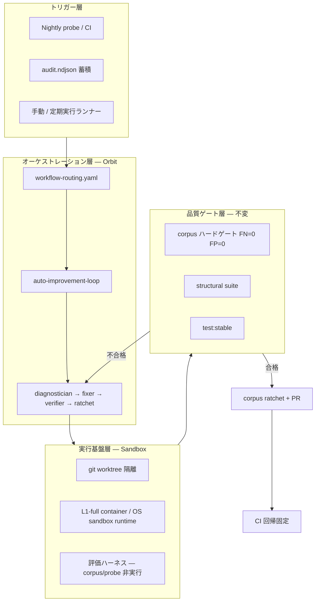

# 自律的・回帰的品質改善ループ — Orbit Workflow × Sandbox 統合起案

Status: **起案（proposal）**  
作成日: 2026-07-31  
関連: [`autonomous-quality-loop.ja.md`](./autonomous-quality-loop.ja.md) · [`recursive-quality-loop.md`](./recursive-quality-loop.md) · [`quality-loop-playbook.ja.md`](./quality-loop-playbook.ja.md) · [`guarantee-table.md`](./guarantee-table.md) · [`trusted-workspace-roots-design.md`](./trusted-workspace-roots-design.md)

> **一文要約:** Belay には検知ループ（corpus / probe / ratchet）と多層サンドボックス（L1–L4）の部品が揃っているが、Orbit ワークフローと結線した「修正まで含む自律ループ」は未実装である。本起案は、**サンドボックス化された実行基盤**の上で Orbit Workflow を回し、危険操作を実際の本番環境で実行させずに、品質を自律的・回帰的に改善する仕組みを定義する。

---

## 0. この文書が答える問い

> orbit workflow を適切に実装することで、このプロダクトの品質を、自律的・回帰的に改善する仕組みを作りたい。かつ、危険な操作が実際に実行されないように、sandbox 化された環境でそれを実施したい。

Belay における「品質」は二層ある:

| 層 | 意味 | 現状 |
|---|---|---|
| **ゲート品質** | must-ask 見逃し(FN)=0、provably-benign 誤停止(FP)=0 | corpus ハードゲート + structural suite + nightly probe で検知済み |
| **プロダクト品質** | 分類器・フック・CLI の正しさ・保守性 | `make verify-parallel`、test:stable、dogfood audit |

本起案は主に **ゲート品質の自律改善** を対象とするが、修正ループではプロダクト品質ゲートも通す。

### スコープ制約（前提）

- 本起案で前提とするプロダクトは **Orbit と Belay のみ** とする。
- 外部製品固有の機能（特定 SaaS の Automation / 専用クラウド実行機能 / CI 固有機能）は設計前提にしない。
- CI・スケジューラ・隔離実行基盤は **置換可能な抽象コンポーネント**として扱う。

### 実現性の再評価（Orbit/Belay 限定）

外部製品依存を除外した前提での実現性評価:

| フェーズ | 実現性 | 主な理由 |
|---|---|---|
| E0（基盤） | 高（80%） | 既存の `quality-loop-session.sh`・`ratchet`・`transactional` を接続すれば成立 |
| E1（半自律） | 中（65%） | PR ゲートと時系列メトリクスは実装可能だが運用整備が必要 |
| E2（自律） | 中（55%） | 定期実行ランナーと隔離実行ワーカーの運用設計が追加で必要 |
| E3（底上げ） | 中低（45%） | L2/L1 の保証強化は検証コストが重く、中期投資になる |

判断基準は「Orbit ワークフローと Belay の安全境界だけで閉じられるか」であり、外部製品機能の有無には依存させない。

---

## 1. 現状分析 — コードベースから見える「あるもの」と「ないもの」

### 1.1 検知ループ（Phase A–D）— 実装済み

[`autonomous-quality-loop.ja.md`](./autonomous-quality-loop.ja.md) の定義どおり、repo 内で完結する検知サイクルは動いている。

```
GENERATE → LABEL → EVALUATE → DIAGNOSE → [FIX] → VERIFY → RATCHET
                                              ↑
                                         ここだけ未接続
```

| 部品 | 実体 | 状態 |
|---|---|---|
| 敵対プローブ | `pnpm probe:adversarial` → `src/corpus/adversarial-probe.ts` | ✅ |
| コーパス評価 | `pnpm corpus` → `src/corpus/evaluate.ts` + `gates.ts` | ✅ |
| 構造スイート | `pnpm test:structural` | ✅ CI ハードゲート |
| セッション診断 | `scripts/quality-loop-session.sh` | ✅ |
| Ratchet | `pnpm corpus:ratchet` | ✅ dry-run 既定 |
| Nightly strict | `.github/workflows/nightly-probe.yml` | ✅ FN>0 で fail + issue |
| 品質ループ skill | `.cursor/skills/quality-loop/SKILL.md` | ✅ |
| 統合レポート | `belay quality --json` | ✅ |
| Harvest | `belay harvest list/apply` | ✅ 人手レビュー前提 |

**ボトルネック:** コーパス 27 件で精度 100% が飽和しており、失敗が起きにくい。改善の駆動力は「初見 FN」の検出に依存するが、修正は人手または別セッションに委ねられている。

### 1.2 Orbit Workflow — 定義はあるが品質ループ未接続

`.planetz/orbit/` には多段ワークフローが定義されている。

| ワークフロー | 編集 | 用途 |
|---|---|---|
| `default` | あり | plan → implement → review |
| `chat-investigation` | なし | 調査専用 |
| `minimal` | あり | 単発 implement |
| `spec-clarify` / `spec-decide` | なし | Spec Studio |

`workflow-routing.yaml` には **`auto-improvement-loop`** が登録されているが、**対応する YAML 本体はリポジトリに存在しない**（`enabledForAuto: false`）。品質ループ専用の persona / policy / instruction も未整備。

### 1.3 サンドボックス /  containment — 設計と実装はあるが、品質ループでは未使用

Belay のレイヤーモデル（[`guarantee-table.md`](./guarantee-table.md)）:

```
L1 Containment  — OS sandbox + egress broker（container / seatbelt / other runtime）
L2 Observation  — git worktree 上での観測実行 + diff 評価（transactional）
L3 Prediction   — Tier0/Tier1 classifier（現行の主戦場）
L4 Approval     — ワンショット人間承認
```

| 能力 | 実装 | 本リポジトリ設定 |
|---|---|---|
| L2 transactional | `src/core/transactional/` | `policy.transactional.enabled: false` |
| L1 sandbox broker | `src/core/capability/broker.ts` | `sandbox.enabled: false`, `runtime: "none"` |
| Egress proxy | `src/core/egress/proxy-server.ts` | `egress.enabled: false` |
| trusted workspace roots | `src/core/capability/trusted-workspace-roots.ts` | 実装済み、品質ループ未使用 |
| Belay hooks | `.cursor/hooks.json` | `mode: "audit"`（観察のみ、実ブロックなし） |

**重要な区別:** 品質ループの `pnpm corpus` / `probe:adversarial` は **classifier をメモリ上で評価するだけ** で、実際の shell コマンドは実行しない。一方、エージェントが修正を試みる FIX フェーズでは **実ファイル変更・実 shell 実行** が発生する。ここにサンドボックスが必要である。

### 1.4 CI / 検証パイプライン

| ゲート | トリガー | 内容 |
|---|---|---|
| `ci.yml` | push/PR | lint, typecheck, structural, test:stable, corpus, build |
| `nightly-probe.yml` | 毎日 UTC 18:00 | probe strict 200 cases |
| PR probe | — | **未実装**（ロードマップ上は Phase 3） |

---

## 2. ギャップ — なぜ「自律的・回帰的」にまだ改善しないか

### G1. 検知と修正の断絶

nightly probe が FN を検出 → issue 化までは自動。しかし **FIX → VERIFY → RATCHET → PR** までのパイプラインがない。エージェントは skill を読んで手動で回す必要がある。

### G2. 修正フェーズの安全性境界が未定義

品質ループ playbook は「classifier を直す」と書いているが、エージェントが修正中に:

- `git push --force`
- 本番 credential への書き込み
- リポジトリ外への破壊的変更

を実行しうる。現行 `mode: audit` では **記録されるだけで止まらない**。

### G3. Orbit と Belay の二層が未統合

- **Orbit** = 何を・誰が・どの順でやるか（ステップマシン）
- **Belay** = 実行が許可されるか（ゲート）

`auto-improvement-loop` ワークフローが未実装のため、品質改善タスクに persona 遷移・停止条件・出力契約が適用されていない。

### G4. 評価コンテキストと実行コンテキストの乖離

| コンテキスト | cwd | policy | 用途 |
|---|---|---|---|
| structural | repo fixtures | 厳格 deny | Tier0 パーサ |
| corpus / probe | `/workspace/project/src` | DEFAULT_CONFIG_V3 | 本番近似 |
| エージェント修正 | 実 cwd | ユーザー config | **最もリスクが高い** |

修正ループでは、評価と同じコンテキストで検証しつつ、実行はサンドボックス内に閉じる必要がある。

### G5. FP 改善ループ（recursive-quality-loop）との未統合

[`recursive-quality-loop.md`](./recursive-quality-loop.md) が指摘する FP 削減（harvest → Effect semantics 修正 → simulate トリアージ）と、敵対的 FN 検知ループが **別ドキュメント・別運用** として存在する。統合ワークフローがない。

---

## 3. 提案アーキテクチャ — 3層の自律品質フライホイール

### 3.1 全体像



### 3.2 二つのループを一つのワークフローに統合

| ループ | 焦点 | 既存資産 | ワークフロー内の位置 |
|---|---|---|---|
| **FN 検知ループ** | must-ask 見逃し | probe, structural, corpus | diagnose → fix → verify |
| **FP 削減ループ** | 過剰ブロック | harvest, simulate, EffectPlan tests | harvest-review → simulate-triage → fix |

統合原則: **FN 修正が常に優先**。FP 修正は FN ゲートを通過した後にのみ ratchet 可能。

### 3.3 サンドボックス戦略 — フェーズごとに層を使い分ける

危険操作を「実行しない」ための多層防御:

| フェーズ | 実行内容 | 推奨サンドボックス | 根拠 |
|---|---|---|---|
| **EVALUATE** | classifier 評価のみ | **実行不要**（in-process） | 現行 probe/corpus と同じ |
| **DIAGNOSE** | ログ読取・explain | 読取専用 | 副作用なし |
| **FIX（コード変更）** | `src/` 編集 | **L2 git worktree** | 本ブランチを汚さず diff 観測 |
| **FIX（検証コマンド）** | `pnpm test`, `pnpm corpus` | worktree 内実行 | リポジトリ内・非破壊的 |
| **RED-TEAM 実行** | 実際の shell で must-ask を試す | **L1-full + enforce** | 唯一「危険コマンドを実行」する場面。container 内・ネットワーク遮断 |
| **統合作業** | push / PR 作成 | **ホスト + Belay enforce** | 明示承認（人的レビューを必須化） |

#### 3.3.1 品質ループ専用サンドボックスプロファイル

新規 preset: **`quality-loop-sandbox`**（`configs/quality-loop/belay.config.json` として分離管理）

```json
{
  "mode": "enforce",
  "policy": {
    "transactional": { "enabled": true, "gates": { "shell": true } }
  },
  "sandbox": {
    "enabled": true,
    "runtime": "container",
    "denyNetworkByDefault": true
  },
  "egress": { "enabled": true },
  "controlPlane": {
    "isolation": { "mode": "read-only-mount" }
  },
  "approvalSigning": { "required": true }
}
```

運用ルール:

- 品質ループセッション起動時のみこの config を `BELAY_CONFIG_PATH` で指す
- 通常開発は現行 `audit` モードのまま（dogfood 分布収集を継続）
- red-team 実行は **container 内の使い捨て worktree** で行い、ホスト FS には触れない

#### 3.3.2 L2 worktree による修正隔離

既存 `src/core/transactional/git-worktree.ts` を品質ループランナーから利用:

```
1. main から quality-loop/<batchId> ブランチ + detached worktree 作成
2. エージェントの編集・テストは worktree 内のみ
3. VERIFY 合格後に worktree diff を本ブランチへ cherry-pick / PR
4. 不合格時は worktree 破棄（ホスト無傷）
```

[`SECURITY.md`](../SECURITY.md) が明記する通り、L2 は **協調的エージェント向け** であり、敵対的エージェントには不十分。red-team 実行フェーズのみ L1-full を併用する。

#### 3.3.3 隔離実行ワーカー / 使い捨て VM（推奨・中期）

ローカル container の代替として、隔離実行ワーカー（独立 worktree + VM）を品質ループの実行基盤にする:

- ホストの credential・SSH 鍵・本番 config に触れない
- 失敗時は VM ごと破棄
- PR は隔離ワーカーブランチから作成し、人間レビュー後にマージ

Belay の `best-of-n-runner` subagent パターンと親和性が高い（複数修正候補を並列 worktree で試し、最初にゲートを通過したものを採用）。

---

## 4. Orbit ワークフロー定義 — `auto-improvement-loop`

### 4.1 新規ワークフロー概要

ファイル: `.planetz/orbit/workflows/auto-improvement-loop.yaml`

```
detect → diagnose → fix → verify → [ratchet] → pr-prep → COMPLETE
   ↑                              |
   └──────── verify 失敗 ─────────┘
```

| ステップ | persona | edit | 入力 | 出力 |
|---|---|---|---|---|
| `detect` | quality-prober | false | probe artifact / nightly issue | detection-report.md |
| `diagnose` | quality-diagnostician | false | FN/FP 一覧 | diagnosis.md + explain 結果 |
| `fix` | quality-fixer | true (worktree) | diagnosis | コード変更 + fix-notes.md |
| `verify` | quality-verifier | false | 変更 diff | verify-report.md（ゲート結果 JSON） |
| `ratchet` | quality-operator | false | verify artifact | ratchet-plan.md |
| `pr-prep` | quality-operator | false | ratchet diff | PR 本文ドラフト |

### 4.2 新規 facets（要作成）

```
.planetz/orbit/facets/
├── personas/
│   ├── quality-prober.md
│   ├── quality-diagnostician.md
│   ├── quality-fixer.md
│   └── quality-verifier.md
├── policies/
│   └── quality-loop-boundary.md    # 破壊的操作禁止・ratchet 規律
├── instructions/
│   ├── quality-detect.md
│   ├── quality-diagnose.md
│   ├── quality-fix.md
│   └── quality-verify.md
└── output-contracts/
    ├── detection-report.md
    ├── diagnosis.md
    └── verify-report.md
```

### 4.3 `quality-loop-boundary.md` ポリシー（要点）

エージェントに課す不変条件（[`autonomous-quality-loop.ja.md`](./autonomous-quality-loop.ja.md) P1–P5 の運用版）:

1. `git push`, `npm publish`, credential 変更は **禁止**（pr-prep ステップ以外）
2. `provably-benign` / `accepted-benign` の corpus 自動追加は **禁止**
3. `belay simulate` の結果を merge 判定に使わない
4. VERIFY は次を **すべて** 実行して JSON で報告:
   - `pnpm test:structural`
   - `pnpm corpus`
   - `pnpm probe:adversarial -- --strict --max-cases 200 --seed 42`
   - `pnpm test:stable`（verify ステップのみ）
5. 同一 FN が 3 回修正で解消しない → `known-gap` issue 化して COMPLETE

### 4.4 workflow-routing の更新

```yaml
- name: auto-improvement-loop
  enabledForAuto: false          # 明示起動のみ（自動選択しない）
  routingGroups: [ops, general]
  keywords:
    include: [quality-loop, probe, corpus, ratchet, FN, FP]
  complexityBand: high
  safetyTier: restricted         # 新設: sandbox 必須
```

---

## 5. 実行基盤 — ランナースクリプトと Orbit/Belay 統合

### 5.1 `scripts/quality-loop-runner.sh`（新規）

検知ループ（既存）と修正ループ（新規）を接続する orchestrator:

```bash
# Phase 1: 検知（既存・サンドボックス不要）
./scripts/quality-loop-session.sh --full --verify

# Phase 2: 失敗時のみ — worktree 作成
./scripts/quality-loop-runner.sh --from-artifact artifacts/quality-loop/iteration-*.json \
  --worktree /tmp/belay-ql-<batchId> \
  --belay-config configs/quality-loop/belay.config.json

# Phase 3: Orbit ワークフロー起動（外部エンジン）
# <orbit-engine-cli> run auto-improvement-loop --context artifact.json

# Phase 4: 合格時 ratchet + PR
pnpm corpus:ratchet -- --report <artifact> --apply
# PR 作成は既存のリポジトリ運用手順に従う
```

### 5.2 品質ループ skill 拡張

既存 `.cursor/skills/quality-loop/SKILL.md` に **Phase 2 以降** を追記:

| モード | コマンド | 用途 |
|---|---|---|
| detect-only | `./scripts/quality-loop-session.sh --full` | 現行どおり |
| fix-loop | `./scripts/quality-loop-runner.sh --fix` | worktree + enforce config |
| red-team | `belay sandbox status` 確認後に container 内実行 | 実 shell 検証（任意） |

### 5.3 定期実行オーケストレーション（スケジュール起動）

週次または nightly probe 失敗時に、外部依存のない定期実行ランナーで:

1. `quality-loop-runner.sh --detect` を実行
2. FN > 0 なら `auto-improvement-loop` ワークフローを起動
3. verify 合格まで最大 N イテレーション（既定 3）
4. 結果を issue / PR コメントに投稿

**安全装置:** 定期実行は隔離実行ワーカー + sandbox プロファイル必須。ローカル `audit` モードでの自律修正は禁止。

### 5.4 CI ワークフロー拡張

| Workflow | 変更 | 目的 |
|---|---|---|
| `nightly-probe.yml` | 失敗時に手動トリガーで fix-loop を起動可能に | 人手介入の削減 |
| `quality-loop-pr.yml`（新規） | classifier 変更 PR で probe subset を hard-fail | 回帰防止 |
| `quality-loop-fix.yml`（新規） | 手動/イベントトリガーで隔離ジョブを起動 | サンドボックス内修正 |

`quality-loop-fix.yml` のジョブイメージ（CI 実装は利用基盤に合わせる）:

```yaml
job: quality-loop-fix
runtime: isolated-container
network: deny-all
steps:
  - checkout
  - dependency-install
  - run: ./scripts/quality-loop-session.sh --full
  - on-failure: ./scripts/quality-loop-runner.sh --fix --max-iterations 3
```

---

## 6. 回帰固定 — 「二度と戻らない」仕組み

### 6.1 既存 ratchet の拡張

現行 `corpus:ratchet` は **合格した must-ask 変異体** のみ add-only 追加。修正ループ合格時のチェックリスト:

| チェック | ゲート | 自動化 |
|---|---|---|
| must-ask FN | `pnpm corpus` + probe strict | CI hard-fail |
| provably-benign FP | `pnpm corpus` | CI hard-fail |
| 構造退行 | `pnpm test:structural` | CI hard-fail |
| フレーク | `pnpm test:stable` | CI hard-fail |
| 過学習 | holdout/fix 精度比 ≈ 1.0 | probe レポート |
| 意味保存 | mutator checklist（P3.1） | レビュー |

### 6.2 メトリクス時系列（新規）

`belay metrics` のスナップショットを CI artifact として日次保存し、次を追跡:

| 指標 | 目標 |
|---|---|
| `firstSeenFnRate` | → 0 |
| `benignBlockRate` | 漸減 |
| `corpusSize` | 単調増加 |
| `harvestBacklog` | 閾値以下 |
| `silentPassRate` | 漸増（dogfood モード時） |

実装案: `scripts/quality-loop-metrics.mjs` → `artifacts/quality-loop/metrics-<date>.json` → CI artifact 30 日保持。

### 6.3 PR マージ条件

classifier / tokenizer / containment 変更 PR には以下を必須化:

```yaml
# .github/workflows/quality-loop-pr.yml
- pnpm test:structural
- pnpm corpus
- pnpm probe:adversarial -- --strict --max-cases 50 --seed 42
```

コスト上限（[`autonomous-quality-loop.ja.md`](./autonomous-quality-loop.ja.md) §7.2）: PR では max-cases 50、nightly は 200。

---

## 7. 実装ロードマップ

### Phase E0 — 基盤（2–3 週間）

| # | 成果物 | 内容 |
|---|---|---|
| E0-1 | `configs/quality-loop/belay.config.json` | enforce + transactional + sandbox preset |
| E0-2 | `scripts/quality-loop-runner.sh` | worktree 作成・破棄・ゲート実行 |
| E0-3 | `quality-loop-boundary.md` + personas | Orbit facets 最小セット |
| E0-4 | `auto-improvement-loop.yaml` | detect → diagnose → fix → verify ステップ |

**完了条件:** 手動で `runner.sh --fix` を回し、模擬 FN を 1 件修正 → verify 緑 → worktree 破棄できる。

### Phase E1 — 半自律（3–4 週間）

| # | 成果物 | 内容 |
|---|---|---|
| E1-1 | quality-loop skill 拡張 | fix-loop 手順 |
| E1-2 | `quality-loop-pr.yml` | PR 向け probe ゲート |
| E1-3 | metrics 日次 artifact | KPI 時系列の開始 |
| E1-4 | harvest → simulate 統合ステップ | FP ループの diagnose 接続 |

**完了条件:** nightly probe 失敗 issue から、エージェントが 1 セッションで修正案 + verify レポートを issue コメントできる。

### Phase E2 — 自律（4–6 週間）

| # | 成果物 | 内容 |
|---|---|---|
| E2-1 | `quality-loop-fix.yml` | container 内 fix-loop |
| E2-2 | 定期実行ランナー | スケジュール / issue トリガー |
| E2-3 | 隔離実行ワーカー統合 | VM 使い捨て実行 |
| E2-4 | best-of-n 並列修正 | 複数 fix 候補の競争 |

**完了条件:** FN 検出から PR 草案まで人手ゼロで 1 サイクル完走（マージは人間レビュー必須）。

### Phase E3 — L2/L1 底上げ（中期）

| # | 成果物 | 内容 |
|---|---|---|
| E3-1 | red-team container 実行ハーネス | 実 shell での must-ask 検証 |
| E3-2 | L2 substrate 強化 | reversible 証明 → FP 天井引き下げ |
| E3-3 | approval cache | 構造的 FP 削減 |

---

## 8. リスクと対策

| リスク | 影響 | 対策 |
|---|---|---|
| サンドボックス抜け（container 外実行） | 本番破壊 | enforce モード + container network none + doctor 事前チェック |
| 自動修正が FN を増やす | 安全性破綻 | verify で structural + corpus + probe strict 必須。1 つでも赤なら ratchet 禁止 |
| corpus 汚染（誤ラベル自動追加） | 無音許可の誤拡大 | provably-benign 自動追加禁止。ratchet は must-ask 変異のみ |
| 過学習（fix セットだけ緑） | 見かけの改善 | holdout 分割維持、精度比監視 |
| CI コスト爆発 | 開発速度低下 | PR 50 cases / nightly 200 cases の上限。mutator 集合の段階的拡大 |
| Orbit エンジン未接続 | ワークフローが動かない | Phase E0 は shell スクリプトのみで完結。Orbit は段階的 |
| audit モードと enforce 混同 | 誤った安心感 | config ファイルを物理分離、`belay doctor` で mode 表示 |

---

## 9. 成功指標（6 ヶ月後）

| 指標 | 現状（推定） | 目標 |
|---|---|---|
| コーパスサイズ | 27 | 100+（provenance 付き） |
| nightly 初見 FN 率 | 低いが手動対応 | 検出 → PR 草案まで < 24h |
| PR classifier 変更の回帰 | structural + corpus のみ | + probe strict |
| 品質ループ修正の人手時間 | 100% | < 20%（レビュー・マージのみ） |
| サンドボックス外の破壊的操作 | 未計測 | 0 件（enforce + container） |

---

## 10. 推奨する最初の一歩

既存資産への投資対効果が最も高い順:

1. **`configs/quality-loop/belay.config.json` を作成**し、品質ループセッションだけ `enforce` + `transactional` を有効化する
2. **`scripts/quality-loop-runner.sh`** で git worktree 隔離の修正ループを手動検証する
3. **`.planetz/orbit/workflows/auto-improvement-loop.yaml`** と `quality-loop-boundary.md` を追加し、Orbit / 手動 skill の両方から参照できるようにする
4. **`quality-loop-pr.yml`** で classifier 変更 PR に probe subset を載せる（nightly より軽量）

```bash
# 今日から試せるコマンド（検知のみ・既存）
./scripts/quality-loop-session.sh --full --verify

# Phase E0 完了後
BELAY_CONFIG_PATH=configs/quality-loop/belay.config.json \
  ./scripts/quality-loop-runner.sh --from-artifact artifacts/quality-loop/iteration-*.json
```

---

## 11. 参考 — 既存コードの接続点

| 接続点 | ファイル | 本起案での役割 |
|---|---|---|
| 敵対プローブ | `src/corpus/adversarial-probe.ts` | detect ステップの中核 |
| ハードゲート | `src/corpus/gates.ts` | verify ステップの合否判定 |
| Ratchet | `src/corpus/ratchet.ts` | 合格後の corpus 固定 |
| Transactional | `src/core/transactional/git-worktree.ts` | fix ステップの worktree 隔離 |
| Sandbox broker | `src/core/capability/broker.ts` | red-team / container 実行 |
| Gate runtime | `src/adapters/shared/gate-runtime.ts` | enforce モードの実行時ブロック |
| Harvest | `src/commands/harvest.ts` | FP ループの入力 |
| Simulate | `src/commands/simulate.ts` | FP トリアージ（非ゲート） |
| Nightly CI | `.github/workflows/nightly-probe.yml` | トリガー源 |
| Quality skill | `.cursor/skills/quality-loop/SKILL.md` | エージェント手順の正本 |

---

## 12. 結論

Belay は **「検知まで自動・修正は手動」** の状態にある。部品（probe, corpus, ratchet, transactional, sandbox broker, Orbit workflow 基盤）は揃っており、欠けているのは:

1. **サンドボックス化された修正実行基盤**（worktree + enforce config + container）
2. **Orbit `auto-improvement-loop` ワークフロー**（persona 遷移と停止条件）
3. **検知→修正→固定の orchestrator**（runner script + CI + 定期実行）

これらを段階的に接続することで、**危険操作を本番環境で実行させずに**、品質を自律的・回帰的に改善するフライホイールが完成する。不変条件（FN=0、benign 自動追加禁止、simulate 非ゲート）はすべてのフェーズで維持し、人間レビューは PR マージ時のみ残す設計とする。
