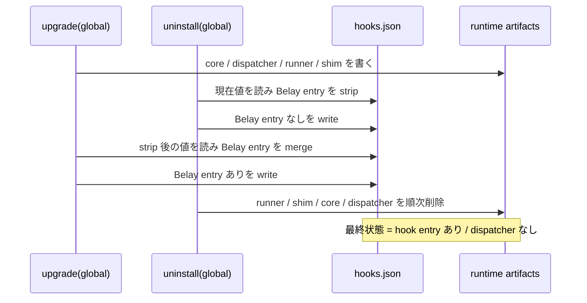

# Cursor global Belay lifecycle 再発障害 RCA — 2026-09-25

## 結論

今回の障害は、単純な `dispatcher.mjs` の削除漏れではない。直接原因は、Cursor の
User/global `hooks.json` に Belay の管理エントリが存在する一方で、そのエントリが静的
import する `~/.cursor/belay/runtime/dispatcher.mjs` が存在しない **split-brain 状態**だった
ことである。

09:17・09:19の再発については、原因となった writer まで特定できた。二つの Cursor
session が global Belay を削除している最中に、別 session が古い source checkout の
`dist/cli.js upgrade` を二度実行した。uninstall 側の artifact 削除と upgrade 側の hook 再公開が
同じ `~/.cursor` に交差し、hook あり / dispatcher なしを再生成した。

最初の09:01障害で dispatcher を消した直近の process は、当時の writer log がないため断定
できない。ただし、2026-09-22には修正前 CLI の HOME-target overlap bug が global artifact を
削除し、その後 `hooks.json` だけを backup から戻して全入口を再び fail-closed にした一連の
操作が transcript に残っている。これは今回と同じ failure signature を実際に生成した、確認済み
の先行経路である。したがって dispatcher が自然に破損したのではなく、複数世代の CLI と複数
session が hook ownership と artifact ownership を別々に更新できたことが原因である。

再発を可能にしている根本原因は、Belay の Cursor ライフサイクル操作
（`init` / `upgrade` / `uninstall` / scope cleanup）が、同じ global `hooks.json` と runtime
成果物群を複数プロセスから変更できるにもかかわらず、次の仕組みを持たないことにある。

1. scope 単位の排他ロック
2. hooks と runtime を一つの世代として扱う commit protocol
3. 明示的 uninstall を後続の暗黙 upgrade より優先する disable marker
4. 操作完了時の end-state invariant 検証

ユーザー申告では同種障害は今回で7回目である。ローカル履歴から過去6回すべてを同じ
failure signature として確定することはできなかったが、少なくとも今回については、削除確認
後に Belay hook 13件が二度再登録された事実が Cursor log に残っている。したがって、今回を
「uninstall が一度失敗しただけ」と扱うことはできない。

## 影響

- 対象 workspace: `/Users/kaz/modis/freelance.base/repos/freelance.modis.co.jp`
- install scope: Cursor User/global
- 失敗した入口: `beforeSubmitPrompt`、および同じ runner/dispatcher を使う actionable hooks
- 観測された例外: `ERR_MODULE_NOT_FOUND`
- 欠損 path: `/Users/kaz/.cursor/belay/runtime/dispatcher.mjs`
- 結果: `failClosed: true` によりプロンプト送信とツール実行が遮断され、PR review を開始不能

Cursor の `failClosed: true` も根本原因の一部である。これは Belay が起動する前にホストが評価
するため、audit mode、例外 catch、neutral response のいずれも介入できない。監査機構が自身の
起動障害を理由に全操作を止めないという可用性要件と両立しない設定だった。

## 確認できた事実

### 1. 障害時のファイル状態

調査時点では次の状態だった。

| 要素 | 状態 |
|---|---|
| `~/.cursor/hooks.json` | 有効な JSON |
| Belay 管理 hook | 13件存在 |
| 他の User hook | 10件存在 |
| `~/.cursor/hooks/belay-runner` | 存在 |
| `~/.cursor/hooks/belay-before-submit.mjs` | 存在 |
| `~/.cursor/belay/runtime/dispatcher.mjs` | 欠損 |

`belay-before-submit.mjs` は dispatcher を静的 import するため、Belay の routing/error handling
へ到達する前に Node が exit 1 となる。この段階では audit mode の fail-open も動作できない。
今回観測したのは dispatcher の内容破損ではなくファイル不在である。構文破損や hash 不一致の
証拠はなく、runtime artifact は単一ファイル単位では temp file から rename されるため、調査上は
partial write より削除・cleanup を原因として扱う。

### 2. uninstall 後に hook が再登録された

Cursor Hooks Service の log では、User hook 数が以下のように変化した。10件が Belay なし、
23件が Belay 13件を含む状態である。

| 時刻（JST） | User hook 数 | 解釈 |
|---|---:|---|
| 09:07:44 | 23 | Belay 有効 |
| 09:09:32 | 10 | Belay 削除 |
| 09:14:16 | 10 | 削除状態を維持 |
| 09:15:05 | — | 別検証が `hooks.json` valid、runtime/runner/skill 不在で exit 0 |
| 09:17:41 | 23 | Belay 13件が再登録 |
| 09:18:31 | 10 | 再び削除 |
| 09:19:05 | 23 | Belay 13件が再登録 |
| 09:26:15 | 10 | source CLI の global uninstall 後の最終状態 |

参照した log:

- `~/Library/Application Support/Cursor/logs/20260923T095705/window1_wb1/`
  `output_20260923T095707/cursor.hooks.workspaceId-fec1b6ca2ac006ed7dcba8efcdb05c2e.log`
- `~/.cursor/projects/Users-kaz-modis-freelance-base-repos-freelance-modis-co-jp/`
  `terminals/955386.txt`

これは「最初の削除処理が何も削除しなかった」という仮説を否定する。削除済み状態が一度成立し、
その後に別の writer が global hook ownership を再公開した。

### 3. 09:17・09:19の writer は concurrent repair session だった

今回の Cursor agent transcript を突合すると、同じ global owner に少なくとも三つの session が
同時に変更を加えていた。

| 開始時刻 | transcript | 確認できた操作 |
|---|---|---|
| 09:04 | `abced3c6-a22a-4b5d-a7b1-23ac3f06f62f` | `hooks.json` から Belay 13件を手動削除し、`rm -rf ~/.cursor/belay ~/.cursor/hooks/belay-*` を並行実行 |
| 09:06 | `422618ca-fcf9-4ee3-aa85-5c7ce4a6b914` | official CLI の global/project uninstall 後、さらに `rm -rf ~/.cursor/belay` を実行 |
| 09:11 | `69f9478a-b337-441b-85a0-62f9b9dd3e2e` | stale checkout `/Users/kaz/product/guilz/belay/dist/cli.js` から global upgrade を二度実行 |

三つ目の session は hook が戻った一方で runner/runtime がない状態、さらに二度目には wrapper は
あるが `dispatcher.mjs` がない状態を観測している。この実行時刻は Hooks Service log の
10→23→10→23（09:14、09:17、09:18、09:19）と一致する。よって09:17・09:19の再発は、
uninstall の副産物ではなく、**uninstall と stale upgrade が同一 global owner を排他なしで奪い
合った競合**である。

参照 transcript:

- `~/.cursor/projects/Users-kaz-modis-freelance-base-repos-freelance-modis-co-jp/agent-transcripts/abced3c6-a22a-4b5d-a7b1-23ac3f06f62f/abced3c6-a22a-4b5d-a7b1-23ac3f06f62f.jsonl`
- 同 directory 配下の `422618ca-fcf9-4ee3-aa85-5c7ce4a6b914/422618ca-fcf9-4ee3-aa85-5c7ce4a6b914.jsonl`
- `~/.cursor/projects/Users-kaz-product-guilz/agent-transcripts/69f9478a-b337-441b-85a0-62f9b9dd3e2e/69f9478a-b337-441b-85a0-62f9b9dd3e2e.jsonl`

### 4. 2026-09-22に同じ split-brain を作った既知の旧版経路

`~/.cursor/projects/Users-kaz-belay/agent-transcripts/7aac6a89-41d8-4a12-a6a8-705ecc14e7c7/7aac6a89-41d8-4a12-a6a8-705ecc14e7c7.jsonl` には、修正前の worktree
build から次を実行した記録がある。

```text
node …/belay-audit-1b3c3201-plan/dist/cli.js upgrade --target /Users/kaz --scope global
```

当時の実装は project target と global HOME が同じ `.cursor` directory になる場合を区別せず、
global install の直後に stale project cleanup として同じ artifact を削除できた。この defect は
後の commit `732d1ec`（#152）で修正された。しかし当該 session はその後、事前保存した
`hooks.json` だけを `/tmp` から復元して同じ旧版 upgrade を再実行し、再び壊れた後にも
`hooks.json` だけを戻した。結果として managed hook は復活したが `belay-runner` は不在となり、
`failClosed: true` が全操作を遮断した。

この履歴は09:01直前の writer を証明しない。一方で、旧 build の実行と settings-only restore が
同じ split-brain を生成できること、および「hooks を戻せば復旧」という運用が artifact 世代を
戻さないことは確定している。

### 5. 障害時 lifecycle は共有状態をロックしていなかった

障害時の `src/installer.ts` は以下の順序で別々のファイルを操作していた。

- `initCursorProject`: hooks を先に read/merge し、runtime 群を書き、最後に `hooks.json` を通常の
  `writeFile` で公開する（94–120行）。
- `upgradeCursorProject`: runtime 群を書いた後、`hooks.json` を read/merge/write する
  （124–173行）。project upgrade は既存の global hook を検出すると global runtime と
  `hooks.json` も更新する（139–159行）。
- `uninstallCursorProject`: `hooks.json` を read/strip/write した後、runner、shim、core、dispatcher
  を一つずつ削除する（230–246行）。
- stale project cleanup も同じく hooks 更新と成果物削除を別々に行う（202–228行）。

個々の runtime ファイルは一時ファイルから `rename` されるため、単一ファイルの更新は atomic
である。しかし、`hooks.json`、runner、shim、core、dispatcher 全体は一つの transaction では
ない。これらの操作を直列化する install lock も存在しない。

### 6. 障害時 uninstall は「今の成果物」を消すだけで、無効化意思を保存しなかった

`uninstallCursorProject` は managed hooks と成果物を消すが、repo-local
`.cursor/belay.config.json` の `installScope: "global"` は変更しない。scope 解決は、明示的な
`--scope` がなければ保存済み `installScope` を再利用する
（`src/installer/scope-config.ts:16–27`）。

このため、明示的 uninstall の後でも、同じ repo または別の global-scope repo に対して
`belay upgrade` が走れば global install は正規動作として復活する。uninstall と upgrade が
同時でなくても再発できる。

## 再現可能な競合経路

障害時コードでは、次の interleaving で今回と同じ end state を作れた。



また、競合がなくても、uninstall 完了後に persisted global scope を使う upgrade が順番に走れば
Belay は再インストールされる。09:17と09:19の再公開は repair transcript の stale upgrade と
時刻・観測状態が一致するため、今回の再発 writer と判断できる。最初の09:01状態については
writer identity log がないため、上図または9月22日の状態がそのまま残ったとは断定しない。

## なぜ既存テストで防げなかったか

`where-uninstall.test.ts` と `installer-scope.test.ts` は、単一 process で
`init -> uninstall -> assertion` を実行し、直後に managed entry と成果物が消えることを確認して
いる。この契約は今回も成立した。

不足している契約は以下である。

- 同じ scope に対する `upgrade` と `uninstall` の並行実行
- uninstall 後に遅延中の writer が hooks を再公開しないこと
- global uninstall 後に repo-local config を使う暗黙 upgrade が復活させないこと
- lifecycle command 成功時に「hook entry と起動必須 artifact が同時に揃う、または両方ない」
  こと
- lifecycle writer の PID、operation、scope、generation を残すこと

ADR-008 の「Publish ownership last」は単一操作の staging failure を扱うが、複数 process 間の
serialization や uninstall の永続的意思までは定義していない。既存の atomic rename も
単一 artifact の破損防止であり、複数 artifact の整合性は保証しない。

## 過去対策が再発を止めなかった理由

Git 履歴には Cursor hook/runtime 周辺だけでも、dispatcher installation、hook precedence、global
sentinel、linked worktree ownership、audit-mode routing、HOME overlap など多数の修正がある。
これらはそれぞれの point failure を修正しているが、ライフサイクルを単一 writer protocol として
扱っていない。

dispatcher が import された後の audit fail-open だけでは、dispatcher 自体が欠損して Node loader
が落ちる今回の障害には到達できない。このため managed Cursor entry 自体を `failClosed: false`
にし、Belay が一行も実行できなくても host action を遮断しないことを最上位の安全網にする。

したがって、追加の例外 catch、doctor 警告、手動再実行だけでは8回目を防げない。

## 恒久対策の必須要件

### P0: host startup failure を必ず fail-open にする

- 全 managed Cursor entry を `failClosed: false` にする。
- Belay が正常起動した後は、enforce mode が JSON response で明示的に deny できる。
- runner、shim、dispatcher の欠損、Node loader error、timeout、invalid JSON は Cursor 自身の
  block 理由にならない。
- 現行 CLI で作成・移行済みの entry については、旧 CLI や手動 `rm -rf` が新 lifecycle lock を
  迂回して artifact を消しても「全コマンド停止」を防ぐ最後の境界になる。
- ただし旧 CLI 自身が `hooks.json` を `failClosed: true` で再公開した場合はこの境界も上書き
  される。同一ユーザー権限の旧実行物を新コードだけで拘束することはできないため、旧 checkout
  の `dist/cli.js` を直接実行しない・削除する運用対策も必須である。

### P0: lifecycle を scope 単位で直列化する

- Cursor の `init` / `upgrade` / `uninstall` / stale-owner cleanup を同じ排他 lock
  の内側で実行する。
- global lock は `~/.cursor` 配下、project lock は対象 repo の `.cursor` 配下に置く。
- project upgrade が global owner も更新する場合は、project/global の両 lock を canonical path 順
  で取得して deadlock を避ける。
- lock owner に PID、operation、scope、token、startedAt を記録し、dead owner のみ安全に回収
  する。PID 再利用や owner 情報破損を stale と断定せず、判定不能なら timeout させる。

### P0: explicit uninstall の意思を記録する

- global uninstall は global-scope disable marker（tombstone）を atomic write する。
- 暗黙の scope 再利用や project upgrade の global refresh は tombstone がある間は global owner
  を再公開しない。
- tombstone を解除できるのは、明示的な `init --scope global` または
  `upgrade --scope global --reactivate` 相当の操作だけにする。
- uninstall が repo-local config を残す現在の仕様を維持する場合でも、この marker は必要。

### P0: end-state invariant を command 内で検証する

成功を返す前に、同じ lock 内で次を検証する。

```text
managed actionable hook が1件でもある
  => runner + referenced shim + dispatcher がすべて regular file

explicit uninstall 完了
  => managed hook が0件 AND managed runtime artifact が0件 AND tombstone が存在
```

違反時は成功を返さず、install 系は publication を取り消し、uninstall 系は hooks の strip を
再適用して安全側へ収束させる。

### P1（追加対策）: `hooks.json` を compare-and-swap 可能な atomic update にする

- same-directory temp + fsync + rename を使う。
- read 時の fingerprint と publish 直前の fingerprint が異なる場合は、lock bypass writer と判断し
  再読込・再計算する。
- unrelated hook entry を保持する現行要件は維持する。

### P1（追加対策）: lifecycle audit を拡張する

本修正では operation ID、PID、operation、scope、repo root、開始・終了時刻、outcome を記録する。
lock を迂回する writer まで特定するには、さらに以下を記録する。

- operation ID、PID identity、adapter、scope、repo root
- before/after hooks fingerprint
- artifact generation
- lock wait/recovery
- tombstone create/clear
- invariant check result

これにより、次回は「誰が09:17に再公開したか」を推測せず特定できる。

## 実装した対策

本修正 branch では次を実装した。

1. 全 managed Cursor hook の `failClosed: false` 化と doctor migration check
2. trusted audit config を特定できる場合の routing/dispatch error neutralization
3. canonical owner path 順の lifecycle lock、live owner timeout、dead PID recovery
4. uninstall 前に作成し runtime 削除後も残る `belay.disabled.json`
5. ordinary upgrade の再有効化拒否と、明示的な `init` / `upgrade --reactivate`
6. runtime 完成後の atomic hook publication、install/uninstall end-state invariant、失敗時の hook strip
7. uninstall を越えて残る `belay-lifecycle.ndjson` の operation ID / PID / scope / target / outcome 記録
8. tombstoned global owner を project upgrade が再公開せず、残存 hook/artifact を除去する処理

新 lifecycle protocol を知らない旧 CLI や手動削除そのものを lock で拘束することはできない。
現行 entry の artifact だけを消された場合は `failClosed: false` により Cursor 全体は止まらず、
doctor と lifecycle log から修復できる。ここが過去の「再発防止」と異なる点である。artifact 欠損
の全経路を列挙するのではなく、欠損が起きても host availability を失わない境界を先に固定した。

一方、今回実行された `/Users/kaz/product/guilz/belay/dist/cli.js` のような旧 build は、ロック、
tombstone、`failClosed: false` の三つをすべて知らず、旧 entry を再公開できる。同一ユーザーが任意
の `dist/cli.js` を直接実行できる環境で、現行 Belay の application code だけからその write を
絶対に禁止することはできない。恒久運用では、修正 release の導入後に既知の旧 build を削除し、
checkout 内の `dist/cli.js` を直接実行せず、単一の配布済み CLI だけを lifecycle 操作に使う。
また `hooks.json` 単体の backup restore を禁止し、復元後は必ず現行 CLI の init/upgrade と doctor
で hook と artifact を同じ世代へ揃える。

## 回帰テスト

本修正で、managed entry の host fail-open、lock の順序・timeout・dead PID recovery・token
release、tombstone、通常 upgrade の拒否、明示 reactivation、project upgrade からの global
復活抑止、end-state invariant、および並行 upgrade/uninstall の収束を追加した。

lock を守らない未知の writer まで検出・再計算する P1 を実装する際は、次の決定的テストを追加
する。

1. barrier を使い `upgrade(global)` と `uninstall(global)` を全ての重要な境界で interleave する。
2. 最終状態が常に complete install または complete uninstall のどちらかであり、split-brain に
   ならないことを検証する。
3. unrelated Cursor hooks が lifecycle 操作と CAS retry 後も保持されることを検証する。
4. command が success を返した直後に end-state invariant を満たすことを subprocess integration
   test で検証する。

単純な並行 `Promise.all` だけでは再現順序が不安定になる。テスト用 filesystem seam または
barrier を入れ、上図の各境界を決定的に停止・再開できるようにする必要がある。

## 現在の復旧状態

2026-09-25 09:26 JST に source build の CLI から global uninstall を再実行した。その後の確認は
以下のとおり。

- `~/.cursor/hooks.json`: valid JSON、Belay entry 0件、他 hook 10件
- `freelance.modis.co.jp/.cursor/hooks.json`: 不在
- global Belay runner/shim: 不在
- global dispatcher: 不在
- Cursor Hooks Service: 10 user hooks を再読込

これは当時の遮断を解除した状態である。本 branch の lifecycle protocol と host fail-open 設定を
release/install するまでは、実環境への恒久対策反映完了とは扱わない。

## 調査上の制約

`ctx` の local history index は generation verification failure と stale lock により検索不能だった。
そのため過去6回の会話を網羅的に照合できていない。今回の Cursor transcript は個別に直接確認
したため09:17・09:19の writer は特定できたが、09:01以前の直近 writer は特定できない。本書では
Cursor hook log、agent transcript、terminal evidence、Git history、現行 source から確認できる範囲を
「事実」とし、09:01への連続性は推定として区別した。
