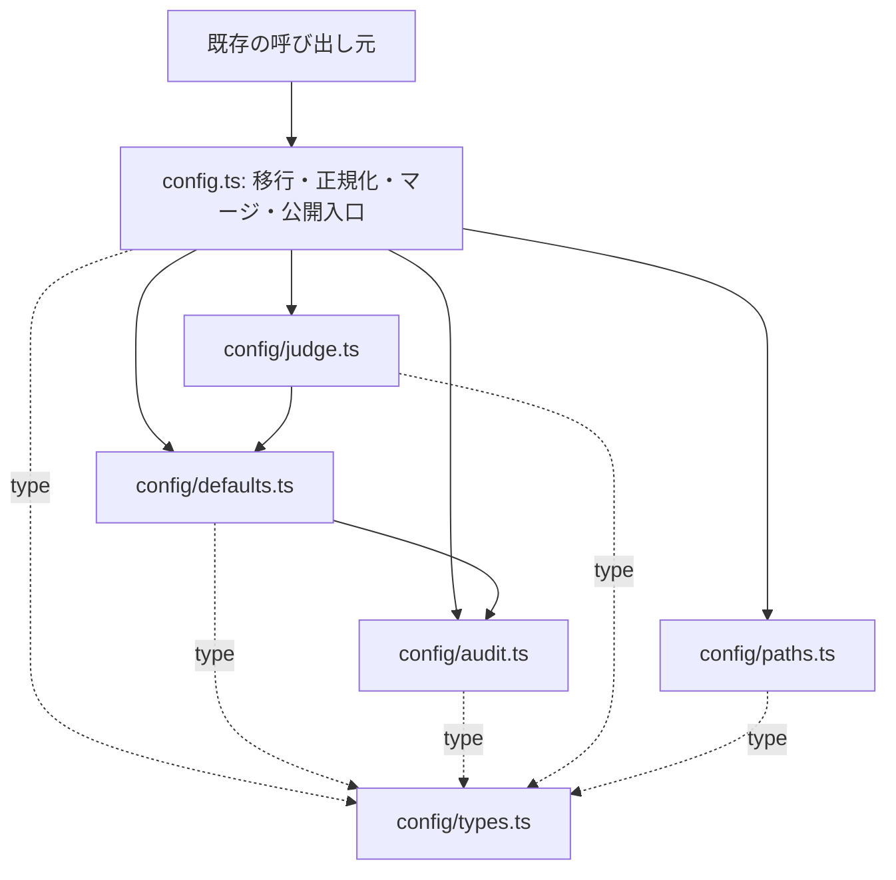

# Belay 段階的リファクタ Implementation Plan

> **For agentic workers:** 実装時は `superpowers:subagent-driven-development` または `superpowers:executing-plans` を使用する。チェックボックスは実装進捗用。レビュー回数・対象・終了条件は、このリポジトリの `AGENTS.md` とユーザー指定を優先する。

**Goal:** 認可・承認・設定互換性を維持し、変更が集中しているモジュールを責務ごとに分割して、変更箇所と検証範囲を小さくする。

**Architecture:** 既存の公開入口を保ったまま、まず設定の独立した責務を葉モジュールへ移す。設定の移行・正規化・マージは当面同じ場所に残す。後続の承認I/O、gate、CLIは別々の変更単位として進める。

**Tech Stack:** TypeScript 5.9.3、Node.js >=22、pnpm 10.29.3、Vitest 3.2.4、Biome 2.4.15。依存追加なし。

**Spec:** 本書の「設計方針と対象範囲」、[CONTEXT](../../CONTEXT.md)、[ADR-004](../../adr/ADR-004-effectplan-shell-authority.md)、[ADR-005](../../adr/ADR-005-command-allowlist-prohibition.md)、[ADR-010](../../adr/ADR-010-repository-config-trust.md)、[ADR-011](../../adr/ADR-011-linked-worktree-config-inheritance.md)。計画作成後、ユーザーからworktreeでのコミット・実装・PR作成の指示を受けた。今回の実装範囲は詳細化済みの段階Aとする。

## Global Constraints

- 正規化できる shell action の認可根拠は EffectPlan のみ。同期 judge や command allowlist を認可経路へ導入しない。
- `src/core/config.ts`、`src/core/index.ts`、`src/index.ts` の既存 export 名、型、関数シグネチャを維持する。新しい内部 helper は公開入口から export しない。
- 設定 v1〜v5 の読み取り互換性、v1〜v3 から v4 への移行、v5 の保持、既定値を維持する。`BelayConfigV3 = BelayConfigV4` と `BelayConfigV4.version: 4 | 5` の命名整理は含めない。
- legacy override は読み取り互換性のみ維持し、保存時の除去と認可上の無効性を維持する。
- audit の既定値 `33_554_432` bytes / `5` files、最大 `100` files、flat/nested のフィールド別優先順位、legacy nested `0` の意味と再保存後の意味を維持する。
- repo config trust は policy layering より先に検証する。継承設定の trust は `configSourceRoot` に対して検証し、存在する壊れたローカル設定を「不在」と扱わない。
- one-shot approval の fingerprint・repo identity・期限・lease・消費回数、`approved_once` の優先順位、revision/lock/atomic write を変更しない。
- Cursor の source ownership と shell の単一評価点を維持する。非ownerと `preToolUse: Shell` の中立経路で policy 評価・承認更新・shell audit を追加しない。
- audit schema、release単位のログ選択、correlation、scrub、通知・イベントの順序と既存メッセージを維持する。
- recovery/contained execution の失敗時に、未検証の host execution へフォールバックさせない。
- 計画作成の次の作業として、専用worktreeでこの計画をコミットし、段階Aを実装・検証してPRを作成する。段階B〜E、設定変更、hook再配置、releaseは含めない。

---

## 1. 調査基準と現状

- 調査日: 2026-09-13。
- 基準 HEAD: `de5e7082de51c9c36c305c0e852f67bb490397d0`。
- 調査時 branch: `fix/dogfood-tool-read-precision`。調査開始時の working tree は clean。
- `src` の production TypeScript は302ファイル、`src/__tests__` の `*.test.ts` は203ファイル。これはファイル数であり、テスト成功数ではない。
- 行数は基準 HEAD の物理行数。優先度は行数だけでなく、責務の混在、既存の境界、変更時の危険性から判断した。
- `ctx` は検証済み検索インデックスを利用できず、履歴検索を根拠にしていない。現行コード、Git履歴、リポジトリ内文書を用いた。
- この計画作成では build/test を実行していない。実装開始時に baseline を取り、下記コマンドを実行する。

| 対象 | 行数 | 現在の問題・根拠 | 扱い |
| --- | ---: | --- | --- |
| `src/core/config.ts` | 1,722 | audit互換処理:26、設定型:202、既定値:343以降、judge正規化:879、移行:1228、正規化:1320、保存:1568、パス:1682が集中 | 最初の詳細実施対象 |
| `src/adapters/shared/gate-runtime.ts` | 2,002 | 設定ロード、状態I/O、実行経路、audit、host応答の調整が同居 | 設定分割後の候補 |
| `src/cli.ts` | 1,365 | 全commandのparse・dispatch・helpが集中 | 独立した後続対象 |
| `src/core/audit-storage.ts` | 1,303 | lock・retention・readinessにまたがるが、最近の不変条件が多い | 今回の実施対象から外す |
| `src/commands/doctor.ts` | 1,044 | 診断と修復の調整が大きい | CLI整理後に再評価 |
| `src/commands/config.ts` | 985 | 非対話設定操作とwizardを同居させている | CLIとは別の後続対象 |

### 過去の分析から引き継ぐ点・更新する点

[2026-06-24の分析](../../refactor-analysis.md)は候補の入口として使うが、そのまま実行しない。

- Configの責務分割は引き続き有効。ただし現在はv5対応、audit retention互換、config trust、linked worktree継承が加わっている。
- [2026-09-09の承認計画](./2026-09-09-one-shot-approval-lifecycle-refactor.md)の主要な抽出先である `one-shot-approval-lifecycle.ts` は既に存在する。Git履歴の `0531b5b`、`9696f48` でも状態遷移・claimの抽出を確認できる。再度の状態機械導入は計画しない。
- `src/core/audit-sink.ts` は既存。新しいAuditSinkを重ねて作らない。
- 旧分析の「Verdict detector pipeline化」は現在のEffectPlan単一権威を前提に再設計が必要。旧Tier0/Tier1モデルを復活させる作業は含めない。
- installerには `src/installer/bootstrap.ts`、`runtime-artifacts.ts`、`scope-config.ts` がある。未分割を前提にした全面再編はしない。

## 2. 設計方針と対象範囲

### 比較した進め方

| 案 | 利点 | 費用・リスク | 判断 |
| --- | --- | --- | --- |
| 設定の葉モジュールから段階的に抽出 | 既存テストを活用でき、認可の順序に触れず責務を減らせる | import/exportと既定値の参照関係を保つ必要がある | 推奨 |
| gate全体を先にpipeline化 | 大きな調整関数を直接小さくできる | approval・grant・mediation・auditの順序が同時に変わりやすい | 後続の限定抽出へ分割 |
| CLIからregistry化 | 認可実装から比較的独立して進められる | parseの癖やhelp・エラー文言を変えやすく、設定内部の負債は残る | 別系列で進める候補 |

### 最初の実施範囲

設定の型、既定値、audit設定互換、judge設定正規化、state pathを抽出する。`migrateConfig`・`normalizeConfig`・`mergeConfig` は `src/core/config.ts` に残す。これらは互いの既定値適用と再正規化に依存しているため、初回から分割すると循環依存や意味の変更を招きやすい。

`src/core/config.ts` は公開入口と設定変換の組み立てを担当する。全呼び出し元のimportを置換する必要はない。`src/config-io.ts`、`config-layers.ts`、`repo-config-trust.ts`、`linked-worktree-config.ts` の処理は初回では変更せず、結合テストで互換性を確かめる。

### 抽出先

すべて以下は新規ファイル。実行時に既存ファイルが追加されていた場合は、上書きせず基準との差分を確認する。

| パス | 責務 | 公開境界 |
| --- | --- | --- |
| `src/core/config/types.ts` | 現在config.tsにある公開interface/typeと内部 `RawConfigInput` | 既存公開型だけconfig.tsから再export。Symbol依存のprivate型はaudit.tsへ |
| `src/core/config/defaults.ts` | audit以外の既存export定数と既定値オブジェクト | 定数名とaliasの参照同一性を維持 |
| `src/core/config/audit.ts` | audit定数、正規化、legacy marker、保存用投影 | 既存公開関数のみ再export。新helperは内部用 |
| `src/core/config/judge.ts` | provider解決、judge正規化、team secret制約、移行用judge補完 | `normalizeJudgeProvider`、`normalizeJudgeConfig`、`rejectTeamLayerJudgeSecrets` を維持 |
| `src/core/config/paths.ts` | control-plane/state/approvalファイルのパス解決 | 既存6関数のシグネチャを維持 |

依存方向は次のとおり。内部モジュールから公開入口 `../config.js` へのruntime importは禁止する。



図は新規モジュール間の依存のみを示す。既存の `judge-catalog.ts`・`judge-runtime-config.ts`・`judge-model-policy.ts`・`audit-summary.ts` との依存は維持する。judge-catalogのconfig参照はtype-onlyなので、今回runtime依存へ変更しない。

## 3. 実施順序と作業量

| 段階 | 独立した成果物 | 依存 | 概算 |
| --- | --- | --- | --- |
| A | 設定の葉モジュール分割（下記Task 1〜4） | なし | 2〜3実装日 |
| B | 承認ファイルI/Oの共通化 | Aの完了後を推奨。技術的には独立 | 1〜2実装日 |
| C | contained実行調整とhost telemetry投影を別々に抽出 | B後を推奨 | 2〜3実装日 |
| D | CLIのparse・実行・helpの境界を分離 | A〜Cから独立 | 2〜3実装日 |
| E | config wizard、doctorの限定分割 | D後を推奨 | それぞれ1〜2実装日 |

概算はコード調査に基づく相対的な目安で、CI待ち・追加の仕様変更は含まない。全体を1PRにまとめない。まずAを完了して効果を評価し、B以降は着手時のHEADで個別計画を固定する。B〜Eは後続ロードマップであり、この文書から一括実装を開始する対象ではない。

## 4. 段階Aの詳細手順

### 共通の検証方針

既存の振る舞いを移動するだけの箇所には、関数の存在やファイル分割そのものを写すテストを増やさない。既存の振る舞いテストを移動前後に使う。新しい保存用投影については、legacy `0` の保存・再ロードを確認するテストを先に用意する。同等の既存テストがあればそれを再利用する。

build前提のテストがあるため、実装開始時に次を順に実行する。以降のfocused testはbuild済みbaselineを前提とする。

```bash
pnpm build
pnpm exec vitest run src/__tests__/config.test.ts src/__tests__/config-mixed-version.test.ts src/__tests__/config-layers.test.ts src/__tests__/config-io.test.ts src/__tests__/repo-config-trust.test.ts src/__tests__/linked-worktree-config.test.ts src/__tests__/decision-config-fingerprint.test.ts
```

期待結果: build成功、対象test成功。既存の失敗があれば内容を記録し、その原因と今回の差分を分ける。期待値を現実装に合わせて緩めない。

### Task 1: 型と既定値の所有場所を分離する

**Files:**

- Create: `src/core/config/types.ts`
- Create: `src/core/config/defaults.ts`
- Create: `src/core/config/audit.ts`（この時点ではaudit定数のみ）
- Modify: `src/core/config.ts`
- Verify: `src/__tests__/config.test.ts`、`config-mixed-version.test.ts`、`config-layers.test.ts`

**Interfaces:**

- 既存公開interface/typeをそのまま `types.ts` に移す。`RawConfigInput` と `BelayJudgeRuntimeConfig` などのtype importも移す。`AuditConfigWithLegacyMarker` はTask 2までconfig.tsに残し、その後Symbolと一緒にaudit.tsへ移す。
- `DEFAULT_CONFIG_V3 === DEFAULT_CONFIG_V4` と `DEFAULT_JUDGE_CURSOR_COMPOSER === DEFAULT_JUDGE_OPENAI_COMPATIBLE_TEMPLATE` を維持する。
- auditの `DEFAULT_AUDIT_MAX_BYTES`、`DEFAULT_AUDIT_MAX_FILES`、`MAX_AUDIT_FILES`、`DEFAULT_AUDIT_RETENTION` は `audit.ts` が所有する。
- 他の既存export定数は `defaults.ts` が所有する。`LOOPBACK_EGRESS_HOSTS` のような正規化専用のprivate定数はconfig.tsに残す。

- [ ] 基準HEAD、既存差分、関連ADRを確認し、実装用の隔離作業領域を確保する。上記baseline検証を行う。
- [ ] 現在のconfig.tsのexport一覧を記録する。runtime exportに加え、型・overload・deprecated aliasも移動後の比較対象にする。
- [ ] 型とaudit定数を移し、defaultsを移す。オブジェクトのspread順、配列の複製、alias参照を変更しない。
- [ ] config.tsでは内部利用用importと既存API用の明示的re-exportを記述する。`export *` による内部型/helperの意図しない公開を避ける。

実際の接続形は以下。既存定義を移動し、定義を二重に残さない。

```ts
// config/defaults.ts
import type { BelayConfigV4 } from './types.js'
import { DEFAULT_AUDIT_MAX_BYTES, DEFAULT_AUDIT_MAX_FILES } from './audit.js'
// 既存のDEFAULT_CONFIG_V4の宣言とinitializerは、そのままこのファイルへ移動する。
// 既存のdeprecated aliasも同じオブジェクトを指す。
export const DEFAULT_CONFIG_V3: BelayConfigV4 = DEFAULT_CONFIG_V4
```

```ts
// config.tsでの接続例。元の全公開symbolを同じ要領で明示的に再exportする。
import { DEFAULT_CONFIG_V2, DEFAULT_CONFIG_V3, DEFAULT_CONFIG_V4 } from './config/defaults.js'
import type { BelayConfigV2, BelayConfigV4, RawConfigInput } from './config/types.js'
export { DEFAULT_CONFIG_V2, DEFAULT_CONFIG_V3, DEFAULT_CONFIG_V4 } from './config/defaults.js'
export type { BelayConfig, BelayConfigV1, BelayConfigV2, BelayConfigV3, BelayConfigV4 } from './config/types.js'
```

- [ ] 次を実行し、型エラー、初期化順序エラー、既定値差分がないことを確認する。

```bash
pnpm typecheck
pnpm exec vitest run src/__tests__/config.test.ts src/__tests__/config-mixed-version.test.ts src/__tests__/config-layers.test.ts
```

**完了条件:** 型と定数の定義場所が一意になり、config.ts経由の既存importがすべて有効。audit.tsからdefaults.ts/config.tsへruntime importがない。

### Task 2: audit設定の互換性処理を一箇所に閉じる

**Files:**

- Modify: `src/core/config/audit.ts`、`src/core/config.ts`
- Test: `src/__tests__/config.test.ts`、`src/__tests__/config-io.test.ts`

**Interfaces:**

- 移動: `normalizeAuditConfig`、`normalizeAuditRetention`、`auditRetentionFromConfig` と、それらのprivate helper。
- 内部export: `auditConfigWithSourceRetention(defaults: BelayAuditConfig, source: Partial<BelayAuditConfig> | undefined): BelayAuditConfig`。config.tsの移行処理から直接呼ぶ。
- 内部新設: `auditConfigForPersistence(audit: BelayAuditConfig): BelayAuditConfig`。
- `LEGACY_DISABLED_RETENTION` と `AuditConfigWithLegacyMarker` はaudit.tsのprivateにする。Symbolを別モジュールで再生成しない。

- [ ] flat/nested優先順位、上限、legacy `0`、保存round-tripについて既存テストを確認する。未カバーならconfig.test.tsの既存importへ `configForPersistence` を追加し、次を追加する。

```ts
it('preserves a disabled legacy bound across persistence and reload', () => {
  const loaded = mergeConfig({
    version: 4,
    audit: { retention: { maxBytes: 0, maxFiles: 2 } },
  })
  const persisted = configForPersistence(loaded)
  expect(persisted.audit.maxBytes).toBeUndefined()
  expect(persisted.audit.retention).toEqual({ maxBytes: 0, maxFiles: 2 })

  const reloaded = mergeConfig(JSON.parse(JSON.stringify(persisted)))
  expect(reloaded.audit.retention).toEqual({ maxBytes: 0, maxFiles: 2 })
  expect(reloaded.audit.maxFiles).toBe(2)
})
```

これは既存挙動の固定なので移動前からPASSを期待する。移動前にFAILする場合、仕様変更を混ぜず既存実装とテストの前提を調べる。

- [ ] auditの既存関数・private helper・Symbolを、処理順を変えずにaudit.tsへ移す。
- [ ] configForPersistenceにあるaudit専用の処理を、次のhelperに移す。

```ts
// config/audit.ts
export function auditConfigForPersistence(audit: BelayAuditConfig): BelayAuditConfig {
  const marked = audit as BelayAuditConfig & AuditConfigWithLegacyMarker
  if (!marked[LEGACY_DISABLED_RETENTION] || !marked.retention) return audit
  const persisted = { ...marked }
  if (marked.retention.maxBytes === 0) delete persisted.maxBytes
  if (marked.retention.maxFiles === 0) delete persisted.maxFiles
  return persisted
}
```

```ts
// config.ts: stripForbiddenShellOverrideListsの順序とno-op時の参照を維持する。
export function configForPersistence(config: BelayConfigV4): BelayConfigV4 {
  const stripped = stripForbiddenShellOverrideLists(config)
  const audit = auditConfigForPersistence(stripped.audit)
  return audit === stripped.audit ? stripped : { ...stripped, audit }
}
```

- [ ] Symbol付きオブジェクトがnormalize/mergeの途中でJSON複製されないこと、既存audit定数が一つのモジュールから参照されることを確認する。
- [ ] 次を実行する。

```bash
pnpm typecheck
pnpm exec vitest run src/__tests__/config.test.ts src/__tests__/config-io.test.ts src/__tests__/audit-sink.test.ts src/__tests__/audit-storage.test.ts src/__tests__/decision-config-fingerprint.test.ts
```

**完了条件:** marker判定とaudit保存用投影の所有者がaudit.tsのみになり、保存後の再ロード、保持設定、decision fingerprintの既存契約が維持される。audit-storageのlockやreadiness実装は変更されていない。

### Task 3: judge設定正規化を移動する

**Files:**

- Create: `src/core/config/judge.ts`
- Modify: `src/core/config.ts`
- Verify: `src/__tests__/config-mixed-version.test.ts`、`src/__tests__/verdict/judge-catalog.test.ts`、`src/__tests__/verdict/judge-runtime-config.test.ts`、`src/__tests__/config-layers.test.ts`

**Interfaces:**

- 公開維持: `normalizeJudgeProvider(provider: string | undefined): 'ollama' | 'openai-compatible' | 'anthropic'`。
- 公開維持: `normalizeJudgeConfig(judge: BelayJudgeConfig): BelayJudgeConfig`。
- 公開維持: `rejectTeamLayerJudgeSecrets(judge: Partial<BelayJudgeConfig> | undefined, source: 'team' | 'repo'): void`。
- 内部export: `synthesizeJudgeFromRaw(raw: RawConfigInput): BelayJudgeConfig`。
- `defaultJudgeTemplateForProvider` はjudge.ts内のprivate関数。

- [ ] 上記関数を宣言・本文ごと移す。provider aliases、endpoint null、modelの補完、警告文言と呼出回数、runtime補完を変更しない。
- [ ] `warnDeprecatedJudgeModelAuto`、judge-catalogのruntime import、`normalizeJudgeRuntimeConfig` のimportを新モジュールへ移す。
- [ ] 設定値の取得先をdefaults/typesへ直接接続する。`src/core/judge-config.ts` はCLI profile・consent用の既存モジュールなので混ぜない。

```ts
// config.tsからの利用と公開境界
import { normalizeJudgeConfig, synthesizeJudgeFromRaw } from './config/judge.js'
export {
  normalizeJudgeConfig,
  normalizeJudgeProvider,
  rejectTeamLayerJudgeSecrets,
} from './config/judge.js'
```

- [ ] 次を実行する。外部LLM通信は不要。model catalogの値は更新しない。

```bash
pnpm typecheck
pnpm exec vitest run src/__tests__/config-mixed-version.test.ts src/__tests__/config-layers.test.ts src/__tests__/verdict/judge-catalog.test.ts src/__tests__/verdict/judge-runtime-config.test.ts src/__tests__/capability/gate-no-judge.test.ts src/__tests__/capability/classification-no-judge-import.test.ts
```

**完了条件:** judge設定正規化が独立し、CLIのjudge操作とgateの同期認可の境界が変わらない。

### Task 4: パス解決を移動し、公開互換性を確認する

**Files:**

- Create: `src/core/config/paths.ts`
- Modify: `src/core/config.ts`
- Verify: `src/__tests__/config.test.ts`、`src/__tests__/config-io.test.ts`、`src/__tests__/linked-worktree-config.test.ts`、`src/__tests__/repo-config-trust.test.ts`
- Docs: 本書のチェックボックスと実装結果欄。公開設定の意味が変わらないためADRやschema本文の改訂は不要。

**Interfaces:** 既存の次の6関数をそのまま移す。

```ts
defaultControlPlaneDir(env?: NodeJS.ProcessEnv, homedir?: () => string): string
resolveControlPlaneDir(config: BelayConfigV4): string
configuredControlPlaneDir(config: BelayConfigV4): string
belayStateDir(config: BelayConfigV4, repoLocalStateDir: string): string
pendingApprovalsFile(config: BelayConfigV4, repoLocalStateDir: string): string
approvedApprovalsFile(config: BelayConfigV4, repoLocalStateDir: string): string
```

- [ ] パス関数の宣言・本文と `node:path` importを移す。引数のdefault式、Windows分岐、環境変数の参照タイミング、enabledによる選択を維持する。
- [ ] `classifierOptionsFromConfig` と `scrubOptionsFromConfig` はconfig.tsに残し、前者から `resolveControlPlaneDir` を直接importする。

```ts
// config.ts
import { resolveControlPlaneDir } from './config/paths.js'
export {
  defaultControlPlaneDir,
  resolveControlPlaneDir,
  configuredControlPlaneDir,
  belayStateDir,
  pendingApprovalsFile,
  approvedApprovalsFile,
} from './config/paths.js'
```

- [ ] 次を実行し、path移動がtrustの保存場所や継承元に影響していないことを確認する。

```bash
pnpm exec vitest run src/__tests__/config.test.ts src/__tests__/config-io.test.ts src/__tests__/repo-config-trust.test.ts src/__tests__/linked-worktree-config.test.ts src/__tests__/config-layers.test.ts
```

- [ ] Task 1で記録した公開exportと比較する。新規内部helperがconfig.ts/core indexへ漏れていないこと、型alias・overload・既定値aliasが残っていることを確認する。
- [ ] 最終検証を順に実行する。

```bash
pnpm lint
pnpm typecheck
pnpm build
pnpm test:run
pnpm test:structural:run
```

`pnpm test:run` はbuildを行わないため、直前にbuildする。通常suiteでstructural suiteが実行済みなら、最後の重複実行は省略できる。新しい失敗や差分がなければ全suiteを何度も繰り返さない。Docker・LLM live testはこの段階の新規ローカル検証には追加せず、既存CIのrequired checkは維持する。

**完了条件:** config.tsは移行・正規化・マージ・保存の組み立てを担当し、抽出した5責務の実装が戻っていない。公開API、設定出力、trust、fingerprintが維持され、既存build/runtime bundleと通常テストが成功する。

## 5. 後続ロードマップ

段階Aと同時に認可経路を変更しない。以下は個別計画を作る際の開始条件と終了条件である。

### B. 承認ファイルI/Oの重複を減らす

**対象:** `src/config-io.ts`、`src/adapters/shared/gate-runtime.ts`、`src/core/approval-service.ts`、`src/core/capability/approval-state-mutation.ts`。

**根拠:** gate-runtime.ts:298の `loadJsonFile`、:342の `loadApprovals`、:358の `writeApprovals` と、config-io.ts:95の正規化、:105のgate読取、:144のatomic writeが並立する。`createGateApprovalStore` はapproval-service.ts:220に既存。

**進め方:** 現在の `ApprovalStore` とone-shot lifecycleを維持し、共通のJSON正規化・serializationを `src/core/approval-state-io.ts` に集約する。gate読取とmigration読取は別関数のままにする。前者の壊れたJSONは空の承認状態、後者は破損として扱うという差を保存する。用途により欠損ファイル・I/Oエラーをどう扱うかも先に比較表へ固定する。

**既にある差:** runtimeの `loadJsonFile` は全例外をfallbackに変換し、writerは直接writeする。config-io側は異なる読取例外契約とtemp/fsync/renameによるatomic writeを持つ。両者が同じ契約だと仮定して置換しない。最初の抽出はこれらの方針を明示的な別関数/portとして保存する。runtimeをfile-backed storeへ完全統一する段階では、例外・耐障害性・file modeの変化を独立した変更として仕様化する。

**実施単位:** 読取・書込契約の固定 → 共通codec/I/O module抽出 → config-io接続 → gate接続 → store統一の別変更を判断。既存storeに並行する第二のrepository抽象は作らない。

**完了条件:** 共有可能なserializationが一箇所になり、revision付きmutation、lockの取得範囲、migrationの破損回避、既存atomic writerのmode `0o600`/`0o700`とfsync/rename順序、compactionの時刻が維持される。異なる失敗時契約は明示された境界に残る。

**検証:** `config-io.test.ts`、`approval-service.test.ts`、`one-shot-approval-boundary.test.ts`、`capability/grant-lease.test.ts`、`capability-gate-runtime.test.ts`。gate側の既存異常系・並行消費テストを変更前後で実行する。

### C. contained実行調整とhost telemetryを別々に抽出する

**対象:** `src/adapters/shared/gate-runtime.ts:567` のcontained処理群と、:1802のhost telemetry処理群。transactional coordinatorの分割はこの段階には含めない。

**C1の進め方:** `mediateContainedUnknownExecution` と出力scrub・failure整形を、新規 `src/adapters/shared/contained-execution-runtime.ts` へ移す。repoRoot、mode、action、command、classification result、contained config、attestation path、protected rootsと、attestation読取・mirror・Docker実行・audit appendのportsを明示的に受け取る。結果は非該当、承認経路へ戻す、処理済みverdictの3分類にし、認可順序の決定はgate-runtimeに残す。

**開始条件:** Bと同時にgate-runtimeを変更しない。現在の呼出順、audit mode/enforce mode、approved_once/capability_grant/未承認の各分岐をテストと照合する。[ADR-006](../../adr/ADR-006-contained-unknown-execution.md)のfallback taxonomyを後続計画へ転記する。

**C1の完了条件:** audit modeではattestation読取・mirror作成・実行なし。実行した場合はoriginal host denyとmirror廃棄を維持する。stdout/stderrは強制scrub後に16 KiBへ制限しauditへ保存しない。承認経路へ戻せるのはcontainer start前の型付きsubstrate/daemon unavailableのみ。lease・mirror・create/inspect・start試行・timeout・cleanup不確定はfail-closedを保つ。

**C2の進め方:** C1とは別差分で、host payloadのcompact処理を既存 `src/core/audit-telemetry-projection.ts` に移す。`repoRoot`、`actionCwd`、`homeRoots` を入力にし、runtimeの `appendObservedAudit` は投影結果をsinkへ渡す。既存projectionとcompact telemetryはshapeが違うため、既存関数を即時に置換・削除しない。

**C2の完了条件:** raw tool_use_idを保存せずcorrelationを一方向hashに保つ。body-free、home絶対pathのscrub、repo外cwd非保存、failure messageの512文字制限、CompactHostTelemetryV1のshapeを維持する。

**検証:** C1は `contained-execution-gate.test.ts`、`contained-execution-contracts.test.ts`、`contained-execution-eligibility.test.ts`、`contained-execution-docker.test.ts`、`contained-execution-mirror.test.ts`、`conformance/adapters.test.ts`。C2は `audit-telemetry-projection.test.ts`、`audit-io.test.ts`、`audit-visibility.test.ts`、`cursor-host-denial-invariants.test.ts`。gate全体への波及は `capability-gate-runtime.test.ts` と `one-shot-approval-boundary.test.ts` で確認する。

### D. CLIをparse・実行・helpの境界で分割する

**対象:** `src/cli.ts`、既存 `src/commands/*` と `src/types.ts`。

**根拠:** cli.ts:53〜729がparse、:731〜779がhelp、:786〜1348がdispatch。`--scope` (:458) と `--command` (:516) はcommand別の意味を持つ。

**進め方:** 最初は現在のparserを `src/cli/parse.ts`、helpを `src/cli/help.ts`、dispatchを `src/cli/dispatch.ts` へ本文ごと移す。新しい汎用option schemaをいきなり作らず、`metrics`・`status`・`report` からcommand単位の定義へ移行できるか、次の小変更で判断する。

**開始条件:** 現在のargv契約を固定する。未知flag、値欠落、位置引数、繰り返しflag、boolean形式、`--help`/`--version`、stdout/stderr、exit codeを対象commandごとに確認する。

**完了条件:** CLI入口は起動とerror handlingを担当し、parser importでCLIが実行されない。既存command grammar、出力、exit codeを保持する。help生成への切替はparser分割と同時に行わない。

**検証:** `cli-ops.test.ts`、`cli-version.test.ts`、`config-command.test.ts`、`commands/judge.test.ts`、`recover.test.ts`、`audit-query.test.ts`。build済みCLIを使う実プロセステストを含める。

### E. config wizardとdoctorの局所分割

**Config wizard:** `src/commands/config.ts` の非対話judge操作を新規 `src/commands/config-judge-service.ts`、wizardを新規 `src/commands/config-wizard.ts` に分ける。config.ts:698で書き、:772と:825で読む `BELAY_CONFIG_WIZARD_JUDGE_KEY` は内部transportとして残っている。`CloudJudgeWizardAnswers` の `credentialKey?: string` とwizardごとのローカル状態で渡す形へ移す。prompt順序・cancel・full/judge-onlyの両経路を先に固定し、失敗時・連続実行時のsecret残留を検証する。設定正規化は段階A、保存は既存 `writeTrustedConfigFile` とcredential storeを利用する。

**Doctor:** `src/commands/doctor.ts` の診断を、設定・hook/runtime・境界・auditのまとまりごとに抽出する。既存のreport配列順と `--fix` の副作用順序を維持し、checkの並列化は行わない。

**完了条件:** 非対話設定操作をpromptなしで検証でき、診断の読取と修復の変更箇所が分かれている。secret保存形式、warning/issueのseverity、終了codeは同じ。

**検証:** `config-command.test.ts`、`config-wizard-prompts.test.ts`、`config-wizard-tui.test.ts`、`doctor.test.ts`、`doctor-advisory.test.ts`、`cursor-hook-routing-health.test.ts`、`dogfood.test.ts`。

## 6. 対象外と再検討条件

- EffectPlan/PolicyEngineの意味変更、verdict全面再実装、judge transport削除、tool/shell認可統合は別の仕様変更として扱う。
- audit-storageのlock回収・readiness再構築・release log選択は、今回の設定分割から切り離す。具体的な変更要求が出たときに対象を限定する。
- Cursor/Claude/Codex runtime-entryの一括共通化は行わない。source ownership、入力正規化、exit code、post-action hookに差があるため、共通化の利益と維持すべき差を独立して検証する。
- 全呼び出し元のimport変更、公開型のrename、schema version更新、依存追加、性能改善目標の導入は含めない。
- ファイル行数だけを成功基準にしない。通常の設定追加で型・default・正規化の所在を特定できること、無関係なI/Oや認可経路を編集しなくてよいことを確認する。

## 7. レビュー・完了・切り戻し

- 段階AはTask順に実施し、変更点を区切って記録する。親エージェントだけがレビューを起動する。
- 同一差分に対する独立レビューは1回。通常レビューは固定した `BASE..HEAD` を対象とし、許可されたblocking修正を1回にまとめ、その修正差分だけを1回限定再レビューして終了する。
- SDDを選ぶ場合もAGENTS.mdの上限を適用する。non-blocking改善や対象外の発見を理由に、修正・レビューのループを延長しない。
- 認可、設定保存、auditの意味が変わる必要が判明したら、その変更をこのリファクタに混ぜない。独立した判断事項として記録する。
- 切り戻し単位は各段階のコード変更。永続データ形式を変えないので、データ移行やapproval/auditファイル削除を伴うrollbackは不要。
- runtime bundleの再buildでは通常 `runtimeArtifactHash` が変わり得る。`decisionConfigFingerprint` の維持とは別に扱う。dogfoodへの再配置は別作業とし、旧runtimeのreadiness証跡を新bundleへ流用しない。

### 実装完了時に残す記録

- [ ] 実際のBASE/HEADと変更ファイル一覧。
- [ ] focused test、lint、typecheck、build、通常suiteの実行結果。
- [ ] export互換、audit保存round-trip、trust/継承、decision fingerprintの確認結果。
- [ ] 初回reviewと限定再reviewの対象・blocking残件。
- [ ] 段階B以降へ進むかを判断する材料。未実施のロードマップ項目を完了扱いにしない。
