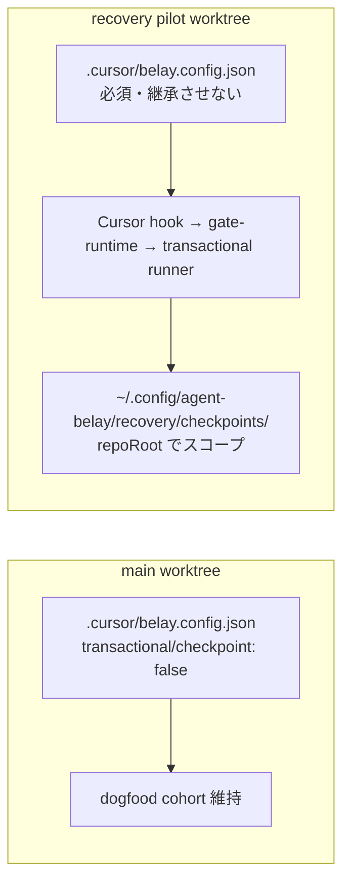

# Recovery 実運用検証 Implementation Plan

> **For agentic workers:** 実装時は `superpowers:executing-plans` または `superpowers:subagent-driven-development` を使用する。完了前に `superpowers:verification-before-completion` で hook 経路の証跡を確認する。チェックボックスは実装進捗用。

**Goal:** 隔離 git worktree と専用 config で Recovery（transactional + checkpoint）を有効化し、clean Git / `git_worktree` 経路の「保存→変更→復元」サイクルを hook 経由で実運用検証する。メイン dogfood cohort には触れない。

**Architecture:** 実装済みの transactional runner と Recovery checkpoint/restore 経路を、dogfood 設定から切り離した pilot worktree で end-to-end 検証する。段階A config リファクタ前後の before/after 比較でデグレを検知する。

**Tech Stack:** TypeScript 5.9.3、Node.js >=22、pnpm 10.29.3、Vitest 3.2.4、Cursor hooks、Belay CLI。

**Spec:** [config-schema §checkpoint](../../config-schema.md), [CONTEXT §Recovery](../../CONTEXT.md), [SECURITY.md §Transactional](../../../SECURITY.md)

**Related:** [段階的リファクタ計画](./2026-09-13-incremental-refactor.md)（段階 A と並行。混ぜない）

## Global Constraints

- main worktree の [`.cursor/belay.config.json`](../../../.cursor/belay.config.json) と dogfood audit log を変更しない。
- pilot worktree にはローカル `belay.config.json` を必須配置し、[ADR-011](../../adr/ADR-011-linked-worktree-config-inheritance.md) による継承設定を使わない。
- Recovery は transactional runner 経由のローカルファイル変更のみ。リモート Git・DB・ネットワーク復元は対象外。
- restore は signed one-shot approval 必須。standing allow、`--yes`、force-restore 経路は使わない。
- 段階A config リファクタで Recovery 契約が変わる場合は、本 pilot から切り離して別 PR とする。
- `approval-token` はオペレータ端末のみ。エージェント shell から取得しない。

---

## 背景

Recovery 実装は完了しているが、現行 dogfood config では次がすべて `false` のため無効:

- `policy.transactional.enabled`
- `policy.transactional.checkpoint.enabled`
- `policy.transactional.fileCheckpoint.enabled`

本計画は **clean Git / `git_worktree` のみ** を対象とする。dirty Git / `file_checkpoint` / non-Git は後続。



---

## デグレ監視対象（watchlist）

段階Aで以下に差分が入った場合、Task 6 の before/after 比較を必須化する。

| 接点 | 監視対象 | 不変条件 |
|---|---|---|
| 設定正規化 | `src/core/config.ts`（将来 `src/core/config/*`） | `policy.transactional.*`、`controlPlane.*`、`audit.logPath` の意味が変わらない |
| state path | `belayStateDir` / `resolveControlPlaneDir` | `controlPlane.enabled: true` で state が `~/.config/agent-belay` を向く |
| transactional 判定 | `src/core/transactional/eligibility.ts` | `allow_flagged` 帯 + excluded reason 条件が維持 |
| checkpoint orchestration | `src/core/recovery/checkpoint.ts` | manifest v2 / repoRoot スコープ / conflict fail-closed が維持 |
| Recovery CLI | `src/commands/recovery-checkpoints.ts` | status/list/show/apply の出力契約と one-shot 承認手順が維持 |

---

## 重要な設定制約

### transactional 経路（`isTransactionalEligible`）

1. `policy.transactional.enabled: true`
2. shell gate 有効
3. 予測 verdict が **`allow_flagged`** かつ confidence が `[minConfidence, maxConfidence)`（既定 0.72–0.88）
4. 除外 reason（external、unparseable、outside_repo 等）でないこと

`policy.transactional.checkpoint.enabled` は eligibility 条件**ではない**。runner が durable pre-image を書くために別途必要。

### Recovery pilot 専用 policy

dogfood config の `unknownLocalEffect: "deny"` では transactional に入れない。Pilot では **`unknownLocalEffect: "allow_flagged"`** を使う（dogfood 定義とは別 cohort）。

`mode: "enforce"` を使う。restore 承認と deny 体験を本番に近づける。

### checkpoint ストレージ

- `controlPlane.enabled: true` → `belayStateDir` は `~/.config/agent-belay`（Windows は `%APPDATA%/agent-belay`）
- checkpoint 本体: `{stateDir}/recovery/checkpoints/cp_*`
- `recover list` は manifest の **pilot worktree 絶対パス** でフィルタ
- audit log のみ repo-local（`.cursor/belay/audit-recovery-pilot.ndjson`）で dogfood 証跡と分離

### hook 初回応答（重要）

**1 回目の hook 呼び出し**で isolated worktree 実行 → observed-safe 変更を working tree に apply → hook は `permission: deny`, `reason: transactional_already_applied` を返す。host 二重実行はない。

---

## Task 0: 自動 baseline

**Files:** なし（検証のみ）

- [ ] 次を実行し、全 PASS を確認する。

```bash
cd /Users/kaz/product/guilz/belay
pnpm build
pnpm exec vitest run \
  src/__tests__/recovery-checkpoint.test.ts \
  src/__tests__/transactional-gate-runtime.test.ts \
  src/__tests__/transactional-eligibility.test.ts
```

**完了条件:** 失敗がなければ pilot 開始可。失敗時は pilot を開始せず先に修正する。

---

## Task 1: Recovery pilot 用 config テンプレート

**Files:**

- Create: `configs/recovery-pilot/belay.config.json`

**手順:**

1. [`.cursor/belay.config.json`](../../../.cursor/belay.config.json) を丸ごとコピー
2. 次のフィールド**のみ**上書き:

| フィールド | 値 | 理由 |
|-----------|-----|------|
| `mode` | `"enforce"` | restore 承認フローを本番同等に |
| `policy.unknownLocalEffect` | `"allow_flagged"` | transactional eligibility |
| `policy.transactional.enabled` | `true` | runner 有効化 |
| `policy.transactional.checkpoint.enabled` | `true` | durable pre-image |
| `policy.transactional.fileCheckpoint.enabled` | `false` | clean Git のみ |
| `audit.logPath` | `".cursor/belay/audit-recovery-pilot.ndjson"` | dogfood audit 分離 |

- [ ] JSON 整合性を確認する。

```bash
node -e "JSON.parse(require('fs').readFileSync('configs/recovery-pilot/belay.config.json','utf8'))"
pnpm typecheck
```

**完了条件:** pilot config テンプレートがコミット可能な状態。

---

## Task 2: 隔離 worktree セットアップ

**Files:** なし（作業環境）

**手順:**

```bash
cd /Users/kaz/product/guilz/belay
git worktree add ../belay-recovery-pilot -b recovery/pilot-2026-09-13

cd ../belay-recovery-pilot
mkdir -p .cursor
cp /Users/kaz/product/guilz/belay/configs/recovery-pilot/belay.config.json .cursor/belay.config.json

pnpm --dir /Users/kaz/product/guilz/belay build
CLI="node /Users/kaz/product/guilz/belay/dist/cli.js"
$CLI upgrade --with-skill --target "$(pwd)"
$CLI doctor --target "$(pwd)"
$CLI recover status --target "$(pwd)"
```

- [ ] pilot worktree を Cursor workspace root として開く。
- [ ] `doctor` が Recovery checkpoint enabled を報告し、inherited config ではないことを確認する。
- [ ] `recover status` で `Checkpointing: enabled` と `git_worktree` backend を確認する。
- [ ] `git status` が clean であることを確認する。
- [ ] main `.cursor/belay.config.json` が未変更であることを確認する。

**完了条件:** preflight 合格。

---

## Task 3: 保存→変更（checkpoint 作成）

### 3a. 事前確認

```bash
$CLI explain --target "$(pwd)" -- 'printf "recovery-pilot-after\n" > recovery-pilot-fixture.txt'
```

- [ ] verdict が `allow_flagged`、confidence が 0.72–0.88 帯であることを確認する。

### 3b. fixture 準備

```bash
echo 'recovery-pilot-before' > recovery-pilot-fixture.txt
git add recovery-pilot-fixture.txt
git commit -m 'chore: recovery pilot fixture'
git status
```

- [ ] working tree が clean であることを確認する。

### 3c. hook 経由で変更

- [ ] Shell hook 経由で 3a と同じコマンドを 1 回実行する。
- [ ] 初回応答が `transactional_already_applied` deny であることを確認する。
- [ ] ファイル内容が変更後の値になっていることを確認する。

### 3d. checkpoint 確認

```bash
$CLI recover list --target "$(pwd)"
$CLI recover show <checkpoint-id> --target "$(pwd)"
```

- [ ] checkpoint 1 件、`state: applied`
- [ ] manifest: `version: 2`, `backend: git_worktree`, `resourceKind: git_repository`
- [ ] audit（`.cursor/belay/audit-recovery-pilot.ndjson`）に recovery フィールドが記録されている

**完了条件:** hook 経由 checkpoint 作成成功。gate 統合テストのみの確認では完了としない。

---

## Task 4: 復元（signed one-shot approval）

restore approval は **`kind: tool`, `reason: recovery_restore`**。

```bash
$CLI recover apply <checkpoint-id> --target "$(pwd)"
$CLI approval-token <approval-id> --target "$(pwd)"
$CLI approve <approval-id> --token <signed-token> --target "$(pwd)"
$CLI recover apply <checkpoint-id> --target "$(pwd)"
```

- [ ] ファイル内容が変更前に戻る
- [ ] checkpoint `state: restored`
- [ ] approve なしの 2 回目 apply では restore されない
- [ ] `metrics --target "$(pwd)"` の recovery restore applied が増加

**推奨:** restore 後に fixture を手動編集 → 再度 apply → `conflict` で拒否されることを確認する。

**完了条件:** signed restore サイクル成功。

---

## Task 5: 証跡記録と後片付け

**Files:**

- Create: `docs/ops/recovery-pilot-evidence-2026-09-13.md`

**記録項目:**

- pilot worktree 絶対パス、branch 名
- `decisionConfigFingerprint`, runtime artifact hash
- 使用 shell コマンド、checkpoint-id、approval-id（**トークン本体は記載しない**）
- `explain` / `recover status` / `doctor` / `metrics` 要約
- hook 初回応答（`transactional_already_applied`）の確認結果
- main dogfood config / audit 未変更の確認
- Task 0–4 の PASS/FAIL

**後片付け:**

```bash
cd /Users/kaz/product/guilz/belay-recovery-pilot
git status
cd /Users/kaz/product/guilz/belay
git worktree remove ../belay-recovery-pilot
git branch -d recovery/pilot-2026-09-13
```

- [ ] pilot branch は main に merge しない
- [ ] 証跡 doc をコミットする

**完了条件:** 証跡記録完了、pilot worktree 削除。

---

## Task 6: 段階Aリファクタ回帰ゲート

**目的:** 段階A（config 分割）で Recovery 契約が壊れていないことを確認する。

### 6a. before（段階A着手前）

Task 3/4 完了直後に次を証跡へ保存:

- `recover status` の主要行
- `recover list` の checkpoint 行
- `recover show` の manifest 主要フィールド
- `metrics` の recovery 集計

### 6b. after（段階A Task 1〜4 完了後）

同一 pilot root で再取得し before と比較する。

**許容差分:** checkpoint-id、timestamp、件数増加

**不許容差分:**

- restore 承認手順の変更
- `manifest.version` の低下、`backend` / `resourceKind` の不整合
- `transactional_already_applied` / `recovery_restore` 契約の破壊
- controlPlane 有効時の stateDir 解決先変更

### 6c. テスト回帰ゲート

段階Aの各 PR で最低限実行:

```bash
pnpm exec vitest run \
  src/__tests__/config.test.ts \
  src/__tests__/recovery-checkpoint.test.ts \
  src/__tests__/transactional-gate-runtime.test.ts \
  src/__tests__/transactional-eligibility.test.ts
```

- [ ] 段階A前後で before/after 比較が一致
- [ ] 上記 focused test が PASS

**完了条件:** Recovery 契約のデグレなし。

---

## リスクと対策

| リスク | 対策 |
|--------|------|
| dogfood cohort 汚染 | 隔離 worktree + ローカル pilot config + 別 audit log |
| ADR-011 継承で pilot が無効 | ローカル config 必須 + `doctor` で inherited でないことを確認 |
| transactional に入らない | `allow_flagged` + 事前 `explain` |
| dirty tree | fixture commit 後に clean 確認 |
| hook root 不一致 | Cursor workspace = pilot worktree |
| approval-token 漏洩 | オペレータ端末のみ |

---

## 完了条件

- [ ] Task 0: focused Vitest 3 ファイル PASS
- [ ] pilot worktree + ローカル config で `recover status` が checkpoint enabled
- [ ] `explain` で対象コマンドが transactional 帯に入る
- [ ] hook 1 回目で変更 apply + `transactional_already_applied` deny
- [ ] `recover list/show` で checkpoint 確認
- [ ] signed one-shot approval 後に restore 成功
- [ ] 証跡 doc 記録、main dogfood config / audit 未変更
- [ ] Task 6: 段階A前後で Recovery 契約の before/after 比較が一致
- [ ] （推奨）conflict 拒否を 1 回確認

---

## 後続（今回スコープ外）

- dirty Git / `file_checkpoint` pilot
- dogfood 全ターゲットへの Recovery 展開
- `scripts/pre-release-dogfood-check.sh` への recovery smoke 追加
