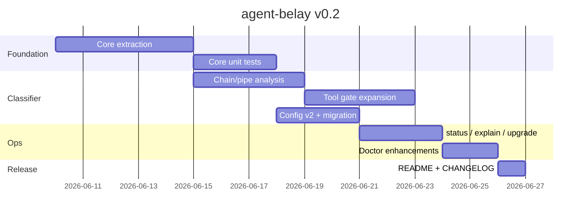

# agent-belay v0.2 プラン

## 前提: v0.1 でできていること

v0.1 は「Cursor 向けフックアダプタ + ヒューリスティック分類器」として、次を実装済みです。

| 領域 | 内容 |
|------|------|
| インストール | `init` / `doctor`、既存 `hooks.json` との共存（prepend/append） |
| Shell ゲート | read-only 許可、ローカル変更は `allow_flagged`、外部/不可逆は deny + 承認 |
| Subagent ゲート | `Task` / `generalPurpose` のキーワード検出 |
| 承認フロー | `/belay-approve <id>` による one-shot、15分 TTL |
| 監査 | `audit.ndjson`、`mode: "audit"` でブロックせず記録のみ |
| UX | 任意 Skill / command テンプレート |

README のロードマップでも、次の一手は **「分類器の強化」** と **「コアとアダプタの分離」** です。

---

## v0.2 のゴール（1文）

> **分類ロジックをテスト可能なコアに切り出し、カバレッジと設定可能性を上げ、運用 CLI を足す。第2アダプタはインターフェースまで。**

v0.2 は「別ランタイム対応の完成」ではなく、「v0.3 以降でアダプタを増やせる土台 + 分類の実用性向上」に寄せるのが現実的です。

---

## スコープ

### In scope（v0.2 でやる）

1. **コア分離（アーキテクチャ）**
2. **分類器の強化**
3. **ツールゲートの拡張**
4. **設定 v2（軽量）**
5. **運用 CLI**
6. **移行・互換**

### Out of scope（v0.3 以降へ）

- Claude Code / Windsurf 等の第2アダプタ実装
- エージェント側 `Assessment` の取り込み
- UI / Web ダッシュボード
- 多回承認・ロールベース承認
- LLM ベース分類

---

## 1. コア分離（最優先）

### 現状の課題

分類・承認・監査の本体が `src/templates.ts` の **巨大な文字列テンプレート**（`renderRuntimeCore`）に埋め込まれています。

- TypeScript 側から直接テストできない（現状は生成後の E2E テストのみ）
- パッケージ `exports` と生成ランタイムが二重管理
- README が言う「abstract Belay substrate」との距離が開きやすい

### v0.2 の設計

```
src/
  core/                    # ランタイム非依存ロジック（新規）
    classify-shell.ts
    classify-subagent.ts
    approval.ts
    fingerprint.ts
    assessment.ts
    types.ts
  adapters/
    cursor/                # Cursor 固有（hook I/O, paths）
      runtime.ts
      installer.ts         # 既存 installer から段階的に移動
  templates.ts             # core を bundle して core.mjs を生成
```

**成果物**

- `classifyShell` / `classifySubagent` の **ユニットテスト**（fixture ベース）
- 生成 `core.mjs` は `src/core/*` のビルド成果物を埋め込む（手書き重複をやめる）
- 公開 API（任意）: `@agent-belay/core` 相当の export を `package.json` に追加検討

**完了条件**

- 既存 `hooks-runtime.test.ts` がすべてパス
- 新規 core ユニットテスト 30+ ケース（後述の分類強化とセット）

---

## 2. 分類器の強化

v0.1 はコマンド名セット + 簡易トークナイザが中心です。v0.2 では「抜け穴」と「誤検知」の両方を減らします。

### 2a. Shell: チェーン・パイプ解析

| ケース | v0.1 | v0.2 目標 |
|--------|------|-----------|
| `git status && git push` | 後段が見えにくい | セグメントごとに最悪 verdict を採用 |
| `curl https://... \| bash` | 未対応の可能性大 | パイプ右辺が `bash`/`sh` なら deny |
| `npm run build` | `allow_flagged` 寄り | スクリプト名ヒューリスティック（deploy/publish 等） |
| `docker run ...` | 未分類 | `docker push/run` を external 扱い |
| `git commit --amend` | `git commit` と同列 | 既存 flagged で十分だがテスト追加 |

### 2b. Shell: カバレッジ拡張

`EXTERNAL_COMMANDS` / `FLAGGED_COMMANDS` の拡張例:

- 追加 external: `terraform apply`, `fly deploy`, `heroku`, `supabase`, `firebase deploy`, `docker push`
- 追加 flagged: `git reset --hard`, `git clean`, `chmod`, `truncate`
- **環境変数経由の秘匿**: `curl -H "Authorization: ..."` は deny ではなく flagged + audit 強化

### 2c. Subagent: 誤検知低減

現状 `EXTERNAL_SUBAGENT_TERMS` に `push` があるため、「git push の調査」系タスクも deny になり得ます。

v0.2 案:

- 語の **文脈スコア**（単語一致 → フレーズ/否定形の簡易ルール）
- `deploy to production` は deny、`investigate production bug` は `allow_flagged`
- `prompt` フィールド全体ではなく `description` / `prompt` を分離して fingerprint

### 2d. Assessment の構造化

分類結果に一貫した `Assessment` を載せ、監査ログを読みやすくする。

```ts
interface Assessment {
  reversibility: 'reversible' | 'recoverable_with_cost' | 'irreversible'
  external: boolean
  blastRadius: string
  confidence: number
  signals: string[]   // v0.2 追加: なぜそう判断したか
}
```

`doctor` や将来の `belay explain` で使えるようにする。

---

## 3. ツールゲートの拡張

v0.1 は `preToolUse` が **`Task` のみ**（matcher 固定）、`subagentStart` が **`generalPurpose` のみ** です。

### v0.2 で追加する hook 対象（Cursor）

| Hook | matcher | 理由 |
|------|---------|------|
| `preToolUse` | `Shell` | エージェントが Shell ツール経由で外部コマンドを実行する経路 |
| `preToolUse` | `Write` / `StrReplace` / `Delete` | リポジトリ外パス・削除系の検出 |
| `subagentStart` | `computerUse`, `debug` 等 | 高リスクサブエージェントの網羅 |

**実装方針**

- ツール種別ごとに `classifyToolUse(payload)` を core に追加
- Shell ツールは `classifyShell` を再利用
- Write 系はパスが repo 外 / `.env` / credential っぽいパスを deny 候補に

**設定で個別 ON/OFF**

```json
{
  "gates": {
    "shell": true,
    "subagent": true,
    "fileMutation": true,
    "toolShell": true
  }
}
```

---

## 4. 設定 v2（軽量）

`belay.config.json` を `version: 2` に。v0.1 設定はマイグレーションで読み込み。

### 新フィールド案

```json
{
  "version": 2,
  "mode": "enforce",
  "approvalTtlMinutes": 15,
  "tokenPrefix": "/belay-approve",
  "gates": {
    "shell": true,
    "subagent": true,
    "fileMutation": true,
    "toolShell": true
  },
  "classifier": {
    "strictChains": true,
    "customExternalCommands": ["./scripts/release.sh"],
    "customAllowCommands": ["pnpm release:staging"],
    "sensitivePaths": [".env", ".env.*", "**/credentials/**"]
  },
  "audit": {
    "logPath": ".cursor/belay/audit.ndjson",
    "includeAssessment": true
  }
}
```

- `customExternalCommands` / `customAllowCommands`: リポジトリ固有の例外（v0.1 では不可能）
- `sensitivePaths`: glob 簡易マッチで Write ゲートに利用

`init` 再実行時は **マージ**（ユーザー追記を消さない）。テンプレート更新用に `agent-belay upgrade` を別コマンド化（後述）。

---

## 5. 運用 CLI

| コマンド | 用途 |
|----------|------|
| `agent-belay status` | pending / approved の一覧、期限切れ件数 |
| `agent-belay explain -- <command>` | ローカルで分類結果を表示（開発・デバッグ用） |
| `agent-belay upgrade` | フック・`core.mjs` のみ更新、`belay.config.json` はマージ |
| `agent-belay revoke <approval-id>` | 誤承認の取消（pending のみ） |

`doctor` 拡張:

- config version 不一致の検出
- 生成 `core.mjs` のビルドスタンプ / パッケージバージョン不一致警告

---

## 6. 移行・互換

| 項目 | 方針 |
|------|------|
| v0.1 → v0.2 | `init` / `upgrade` で自動マイグレーション。`version: 1` config は読み込み時に v2 へ正規化 |
| 承認状態 | `pending-approvals.json` スキーマは維持（互換） |
| 監査ログ | 新フィールド追加のみ（破壊的変更なし） |
| `--nightly` | v0.2 で削除（v0.1 で deprecated 済み） |

---

## マイルストーン（実装順）



※ カレンダー日数は目安ではなく、**依存関係の順序**を示しています。

### Phase A — 基盤（ブロッカー）

- [x] `src/core/*` へ分類・承認ロジックを抽出
- [x] テンプレート生成を core bundle 経由に変更
- [x] 既存 E2E テスト維持

### Phase B — 分類・ゲート

- [x] チェーン/パイプ解析
- [x] コマンド・サブエージェント辞書拡張 + 誤検知ルール
- [x] `preToolUse` Shell / Write 系ゲート
- [x] config v2 + マイグレーション

### Phase C — 運用

- [x] `status`, `explain`, `upgrade`, `revoke`
- [x] `doctor` バージョン検査

### Phase D — リリース

- [x] README Roadmap 更新（v0.2 完了 / v0.3 予告）
- [ ] `0.2.0` タグ、npm publish

---

## 成功指標（v0.2 の Done 定義）

1. **テスト**: core ユニットテスト + 既存 integration すべて green
2. **カバレッジ**: 既知の bypass パターン（`&&`, `|`, ツール経由 Shell）に対する deny/flagged テストが追加されている
3. **運用**: `explain` で分類理由（`signals`）が見える
4. **アップグレード**: v0.1 で `init` したリポで `upgrade` 後も承認フローが動く
5. **後方互換**: v0.1 の `belay.config.json` をそのまま読める

---

## v0.3 への橋渡し（v0.2 ではやらないが設計だけ残す）

README の「additional runtime adapters」に向けて、v0.2 で `Adapter` インターフェースだけ定義:

```ts
interface BelayAdapter {
  name: string
  install(repoRoot: string, options: InitOptions): Promise<void>
  doctor(repoRoot: string): Promise<DoctorReport>
  hookEvents(): Record<string, ManagedHookDefinition>
}
```

v0.3 で `cursor` 実装をこの interface に移し、2つ目のアダプタ（例: 汎用 `hooks.json` 以外のホスト）を追加。

---

## リスクとトレードオフ

| リスク | 対策 |
|--------|------|
| コア抽出で生成物サイズ増 | esbuild 等で single-file bundle、テストは core 直叩き |
| 分類強化で誤 deny 増 | `audit` モード推奨、`customAllowCommands`、explain で調整可能に |
| `init` 再実行でユーザー設定消失 | v0.2 から config **マージ**、`upgrade` と `init` の責務分離 |
| ツール hook の matcher 増加で Cursor 負荷 | ゲート単位で OFF 可能に |

---

## まとめ

| バージョン | 焦点 |
|------------|------|
| **v0.1**（実装中） | Cursor フック + one-shot 承認 + 基本ヒューリスティック |
| **v0.2**（本プラン） | **テスト可能なコア** + **分類・ゲート強化** + **config v2** + **運用 CLI** |
| **v0.3**（次） | 第2アダプタ + Assessment 連携の足がかり |

v0.2 の中心は「賢くする」より **「壊れにくく・拡張しやすく・運用しやすくする」** ことです。分類精度は v0.1 比で明確に上がりますが、静的 denylist の代替ではなく、README が述べる hook heuristic のままです。
